# Vulnerability Assessment Report: Nikto Scan of a Sample Web Application

## 1. Objective

The objective of this assignment is to use **Nikto**, an open-source web server vulnerability scanner, to perform a vulnerability assessment against a locally hosted web application, and to interpret the resulting findings in terms of their security risk and appropriate remediation.

The target application used for this assessment is **DVWA (Damn Vulnerable Web Application)**, a deliberately vulnerable PHP/MySQL web application designed for security training in a legal, controlled environment.

---

## 2. Background

### 2.1 What is Nikto?

**Nikto** is a free, open-source command-line tool used to scan web servers for known security issues. It works by sending thousands of automated test requests to a target website and checking the responses for things like outdated software versions, missing security headers, exposed configuration files, dangerous default files, and other common misconfigurations. It does not attempt to exploit anything; it simply identifies and reports potential weaknesses, which a security professional then reviews and prioritizes for fixing. This makes it a good first step in a vulnerability assessment, similar to a health check-up rather than actual surgery.

### 2.2 What is DVWA?

**DVWA (Damn Vulnerable Web Application)** is a PHP/MySQL web application that is deliberately built with security flaws, for the sole purpose of letting students and security professionals practice finding and understanding vulnerabilities in a safe, legal, and controlled environment. It is one of the most widely used training tools in cybersecurity education and is not, and should never be, deployed on a real public-facing server.

DVWA includes a menu of individual "labs," each simulating a different category of common web vulnerability, such as SQL Injection, Cross-Site Scripting (XSS), Command Injection, File Upload flaws, and CSRF. It also allows the difficulty/security level of these vulnerabilities to be adjusted, so learners can start with the easiest ("Low") setting and progress to more realistic, harder-to-exploit configurations.

For this assignment, DVWA was used purely as a **realistic, safe target** for Nikto to scan; the scan itself does not exploit any of DVWA's individual vulnerability labs, but benefits from scanning a real application (with real files, folders, and configuration) rather than a blank web server.


### 2.3 Why use two separate virtual machines?

In this lab, the **target** (Ubuntu, running the vulnerable DVWA application) and the **attacker** (Kali, running Nikto) were kept on two separate machines connected over a network, rather than scanning `localhost` on a single machine. This more closely simulates a real-world scenario, where a security tester scans a remote server over a network rather than testing an application running on their own machine.

---

## 3. Lab Environment

| Component | Detail |
|---|---|
| Attacker machine | Kali Linux (running in Oracle VirtualBox) |
| Target machine | Ubuntu Linux (host machine, running Apache2 + DVWA) |
| Target web server | Apache/2.4.52 (Ubuntu) |
| Target application | DVWA (Damn Vulnerable Web Application) |
| Database | MariaDB 10.6.23 |
| Network mode | VirtualBox Bridged Adapter (both machines on the same LAN subnet) |
| Target IP address | 10.2.23.188 |
| Attacker IP address | 10.2.23.24 |
| Nikto version | 2.5.0 |

---

## 4. Target Setup: Installing DVWA on Ubuntu

**Step 1 : Install Apache2**

```bash
sudo apt install apache2 -y
sudo systemctl start apache2
sudo systemctl enable apache2
```

Apache was installed and confirmed running via `systemctl status apache2`.

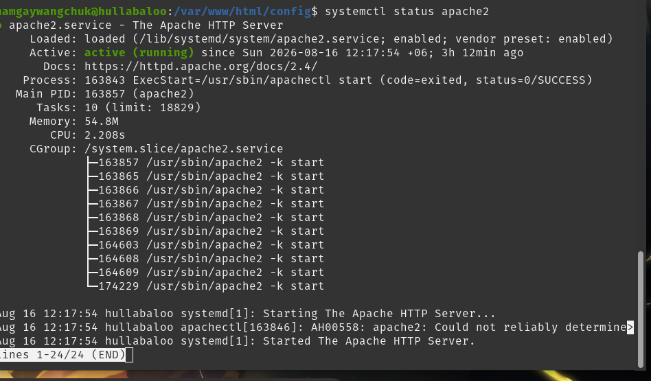

**Step 2 : Install DVWA dependencies (PHP, MariaDB)**

```bash
sudo apt install php php-mysqli php-gd libapache2-mod-php mariadb-server -y
sudo systemctl start mariadb
sudo systemctl enable mariadb
```

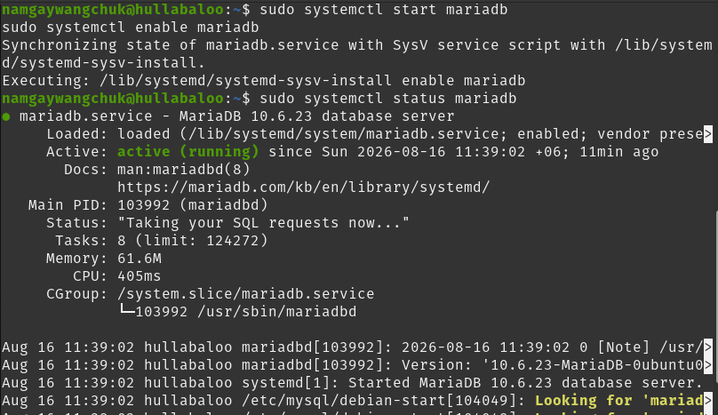


**Step 3 : Clone DVWA into Apache's web root**

```bash
cd /var/www/html
sudo rm -f index.html
sudo git clone https://github.com/digininja/DVWA.git .
```

The repository cloned successfully, producing the expected DVWA folder structure (`config`, `vulnerabilities`, `login.php`, `setup.php`, etc.).

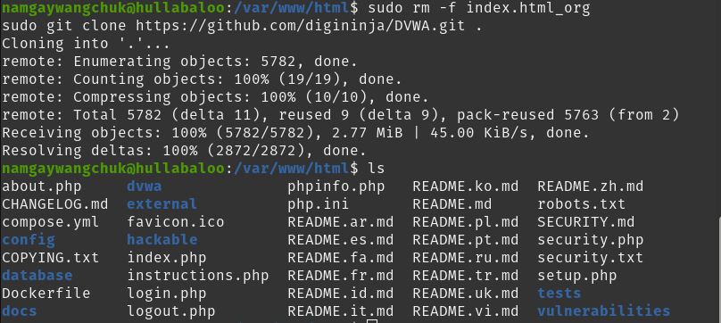

**Step 4 : Configure the database connection**

```bash
cd /var/www/html/config
sudo cp config.inc.php.dist config.inc.php
sudo nano config.inc.php
```

The `db_user`, `db_password`, and `db_database` fields were set to `dvwa`, `p@ssw0rd`, and `dvwa` respectively.

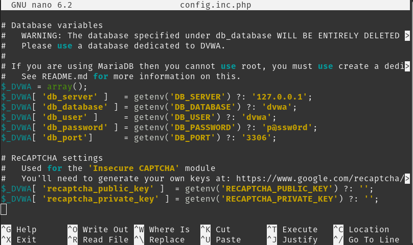

**Step 5 : Create the matching database and user in MariaDB**

```sql
CREATE DATABASE dvwa;
CREATE USER 'dvwa'@'localhost' IDENTIFIED BY 'p@ssw0rd';
GRANT ALL PRIVILEGES ON dvwa.* TO 'dvwa'@'localhost';
FLUSH PRIVILEGES;
EXIT;
```

All commands returned `Query OK`, confirming the database and user were created successfully.

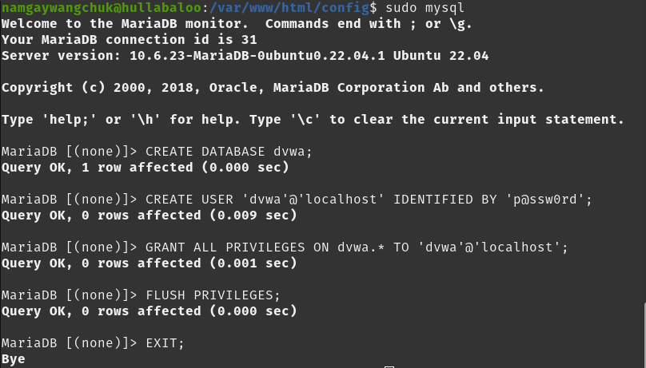

**Step 6 : Fix folder permissions**

```bash
sudo chmod -R 777 /var/www/html/hackable/uploads/
sudo chmod -R 777 /var/www/html/config/
```

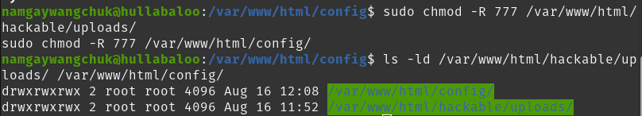

**Step 7 : Enable `allow_url_include` in PHP configuration**

```bash
sudo nano /etc/php/8.1/apache2/php.ini
```

Changed `allow_url_include = Off` to `allow_url_include = On`, then restarted Apache:

```bash
sudo systemctl restart apache2
```

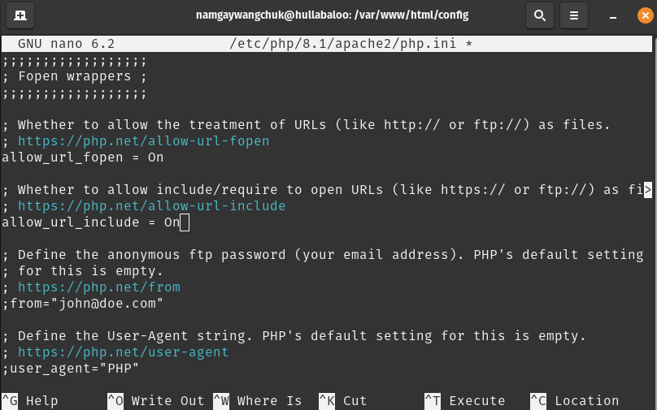

**Step 8 : Run the DVWA database setup**

Navigated to `http://localhost/setup.php`, confirmed the environment checks (PHP version, database connection, writable folders) passed, and clicked **"Create / Reset Database."**

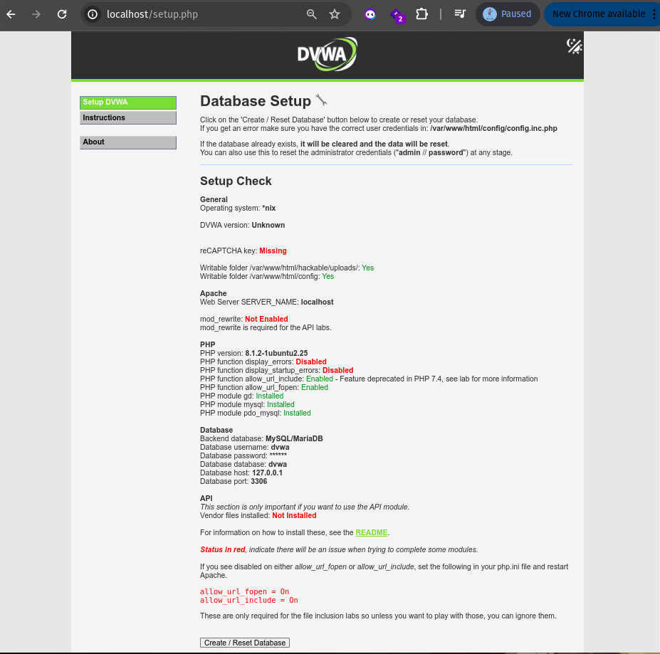


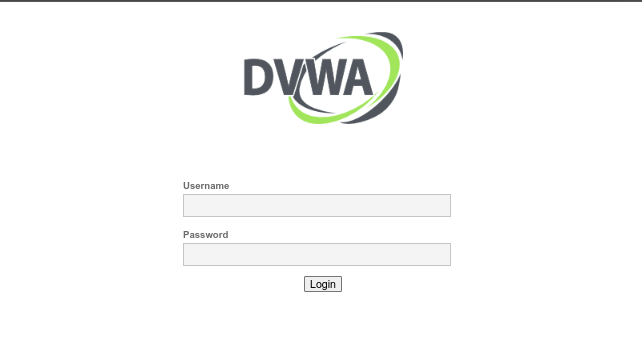

**Step 9 : Log in to DVWA**

Logged in using the default credentials `admin` / `password`.


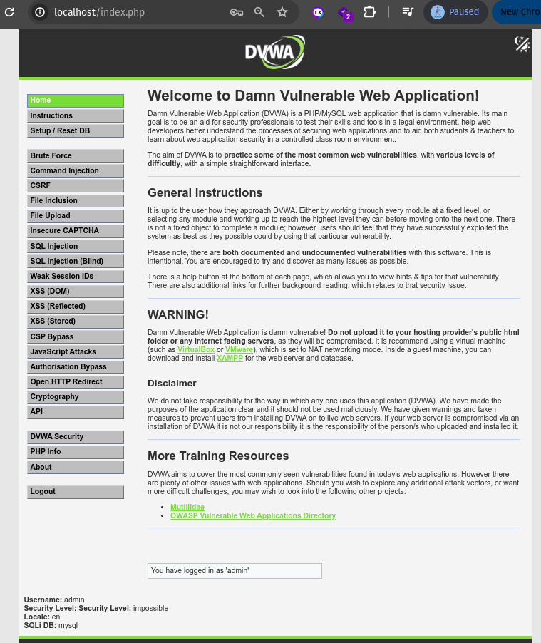


**Step 10 : Set DVWA security level to Low**

Navigated to the **DVWA Security** tab and set the security level to **Low**, so that the application's intentional vulnerabilities would be fully exposed for scanning.

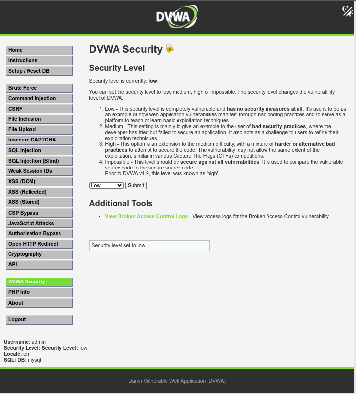

---

## 5. Network Configuration : Connecting Kali to the Target

**Step 1 : Identify the target's IP address**

On the Ubuntu target machine:

```bash
ip a
```

Target IP identified as `10.2.23.188`.

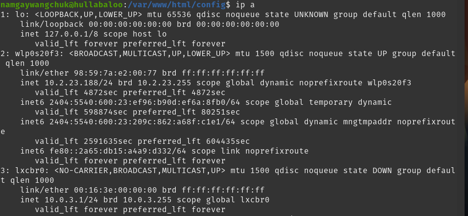


**Step 2 : Switch Kali's network adapter to Bridged mode**

By default, Kali's VirtualBox network adapter was set to NAT, which placed it on an isolated private subnet (`10.0.2.15`) unable to reach the target. In VirtualBox Settings → Network, Adapter 1 was changed from **NAT** to **Bridged Adapter**, using the host's WiFi interface.


**Step 3 : Confirm Kali received an IP on the same subnet**

```bash
ip a
```

Kali's `eth0` interface received IP `10.2.23.24` — confirming it is now on the same subnet as the Ubuntu target (`10.2.23.188`).

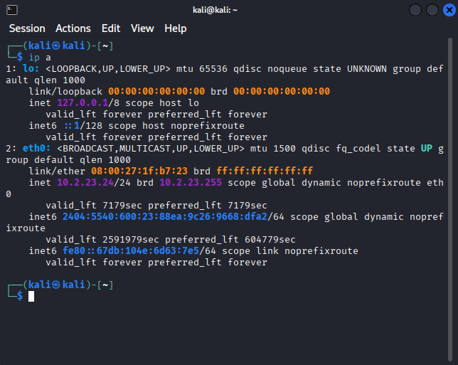

**Step 4 : Test connectivity with ping**

```bash
ping 10.2.23.188
```

Replies were received, confirming network-layer connectivity between attacker and target.

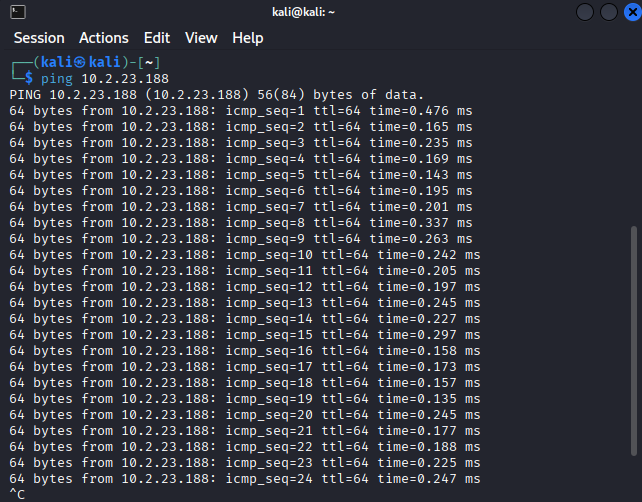

**Step 5 : Confirm the web application is reachable**

Opened `http://10.2.23.188` in Kali's browser and confirmed the DVWA login page loaded correctly.

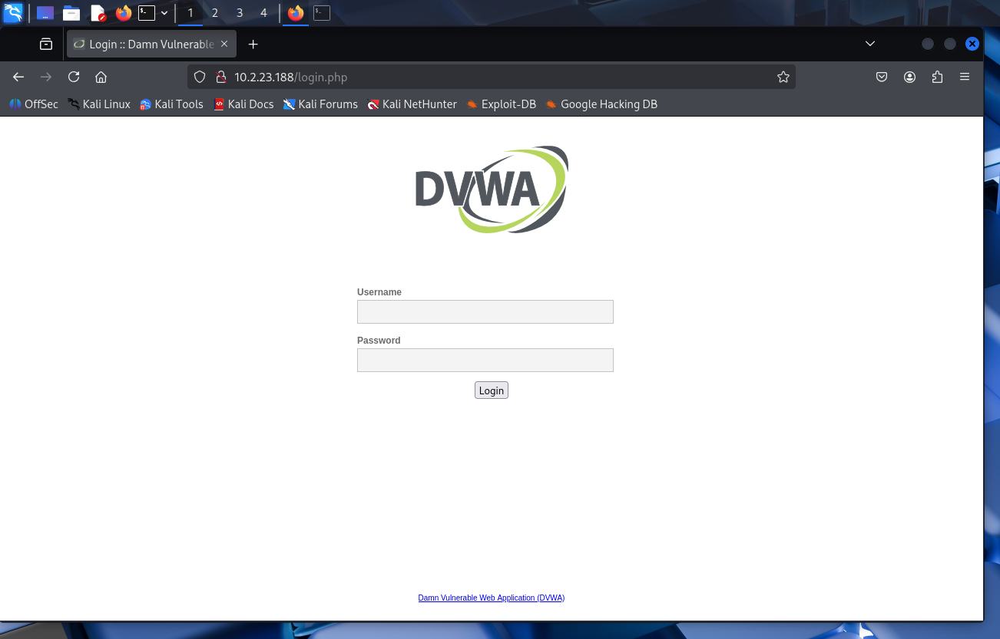

---

## 6. Scan Execution

**Step 1 : Confirm Nikto is installed**

```bash
nikto -Version
```

Confirmed Nikto v2.5.0 was available on Kali.

**Step 2 — Run the scan**

```bash
nikto -h http://10.2.23.188 -o nikto_report.html -Format html
```

The `-o` flag saves a copy of the results to an HTML file in addition to displaying them in the terminal, and `-Format html` specifies the output format for that file.

The scan completed in 11 seconds, sending 8,102 requests and reporting 16 items of interest with 0 errors.

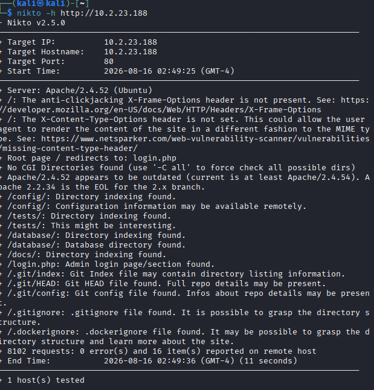


**Step 3 : Review the saved HTML report**

Opened the saved `nikto_report.html` file in a browser for a cleaner, formatted view of the same results.

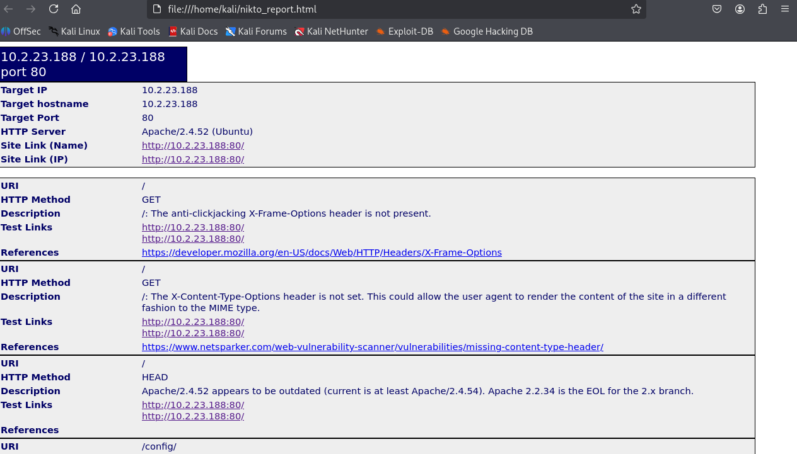

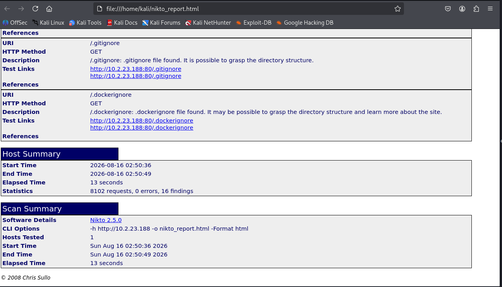

---

## 7. Findings and Interpretation

| # | Finding | What It Means | Risk Level | Recommended Fix |
|---|---|---|---|---|
| 1 | `Server: Apache/2.4.52 (Ubuntu)` | The web server discloses its exact software name and version in the HTTP response headers. | Medium | Set `ServerTokens Prod` and `ServerSignature Off` in the Apache configuration to suppress version disclosure. |
| 2 | Apache 2.4.52 appears outdated (current ≥ 2.4.54) | The server is running a version with known, publicly documented vulnerabilities that have since been patched in later releases. | High | Update Apache to the latest stable release and apply a regular patching schedule. |
| 3 | `X-Frame-Options` header not present | The site can be embedded inside an `<iframe>` on another, potentially malicious, website. | Medium | Add the header `X-Frame-Options: DENY` or `SAMEORIGIN` to server responses. |
| 4 | `X-Content-Type-Options` header not set | Browsers may "MIME-sniff" the content type of a response instead of trusting the declared type, which can be leveraged in some attacks. | Low–Medium | Add the header `X-Content-Type-Options: nosniff`. |
| 5 | `/config/` directory indexing enabled | The contents of the configuration folder can be browsed directly by anyone visiting the URL. | High | Disable directory indexing with `Options -Indexes` in the Apache configuration. |
| 6 | `/config/` configuration information may be exposed | Configuration files in this directory can contain database credentials, secrets, and internal file paths. | Critical | Move sensitive configuration files outside the public web root, or explicitly block access to them. |
| 7 | `/tests/` directory indexing enabled | Internal testing scripts and files are exposed to the public. | Medium | Disable directory indexing and remove test/development files from the production web root. |
| 8 | `/database/` directory indexing enabled / database directory found | The database-related folder is browsable, which could reveal schema files, backups, or credentials. | High | Disable indexing and store database-related files outside the public web root. |
| 9 | `/docs/` directory indexing enabled | Internal documentation is publicly browsable, potentially revealing details about the application's internals. | Low–Medium | Disable indexing or remove the documentation folder from the public web root. |
| 10 | `/login.php` admin login page found | Confirms the location of the authentication endpoint. | Informational | Not a vulnerability by itself, but useful reconnaissance for an attacker attempting credential stuffing or brute-force attacks; consider rate-limiting and account lockout policies. |
| 11 | `/.git/index`, `/.git/HEAD`, `/.git/config` exposed | The application's entire Git repository, including commit history (and potentially credentials committed in the past), is publicly downloadable. | Critical | Never deploy the `.git` directory to a public web root. Block access to hidden dotfiles/directories in the Apache configuration. |
| 12 | `/.gitignore` exposed | Reveals which files and paths the developer intentionally excluded from version control, giving an attacker a "map" of potentially sensitive files to look for. | Low | Remove or block access to hidden configuration files in the public web root. |
| 13 | `/.dockerignore` exposed | Reveals details about the Docker build context and deployment structure. | Low | Same remediation as above — restrict access to hidden dotfiles. |

---

## 8. Risk Summary

| Risk Level | Count | Findings |
|---|---|---|
| Critical | 2 | Exposed `.git` repository, exposed `/config/` directory contents |
| High | 3 | Outdated Apache version, `/config/` indexing, `/database/` indexing |
| Medium | 4 | Missing `X-Frame-Options`, `/tests/` indexing, `/docs/` indexing, missing security headers (combined) |
| Low | 2 | `.gitignore` and `.dockerignore` exposure |
| Informational | 1 | Login page location disclosed |

---

## 9. Conclusion

This assessment demonstrates how a default or development-stage deployment, such as this instance of DVWA, can expose sensitive internal files, directory structures, and outdated software versions to any remote attacker — even without exploiting a single application-level vulnerability such as SQL injection or XSS. All 16 findings reported by Nikto were the result of simple misconfigurations and leftover development artifacts.

**Top three priorities for remediation, in order of severity:**

1. **Remove the exposed `.git` directory.** This is the most critical finding, as it could allow an attacker to download the entire source code and commit history of the application, potentially including credentials or secrets committed earlier in development.
2. **Disable directory indexing on `/config/`, `/database/`, `/tests/`, and `/docs/`.** These folders should never be browsable directly, as they can expose credentials, schema details, and internal application logic.
3. **Update Apache to the latest stable version** to close off any publicly known vulnerabilities associated with the currently installed version.

More broadly, this exercise highlights the importance of removing development and version-control artifacts before any deployment, disabling unnecessary directory browsing, applying standard HTTP security headers, and maintaining a regular patch schedule for server software : all of which are basic but essential steps in web server hardening.

---

## 10. Tools Used

- **Nikto v2.5.0** : web server vulnerability scanner
- **Kali Linux** : attacker/scanning machine
- **Ubuntu Linux + Apache2 + MariaDB** : target machine
- **DVWA (Damn Vulnerable Web Application)** : intentionally vulnerable test target
- **Oracle VirtualBox** : virtualization platform (Bridged Adapter networking)

---
