# CSRF (Cross-Site Request Forgery)  Vulnerability Demonstration and Mitigation Report

## 1. Objective

The objective of this assignment is to:

1. Build a simple, realistic web application containing a form that is vulnerable to **Cross-Site Request Forgery (CSRF)**.
2. Demonstrate a working CSRF attack against that form, showing that an attacker's page can silently modify a logged-in victim's account data without their knowledge or consent.
3. Fix the vulnerability by implementing **CSRF tokens**, and demonstrate that the same attack, run again in exactly the same way, now fails.

---

## 2. Background; Key Concepts

### 2.1 What is CSRF?

**Cross-Site Request Forgery (CSRF)** is a web security vulnerability that tricks a logged-in user's browser into submitting an unwanted, forged request to a website they are currently authenticated on; without the user's knowledge or intent.

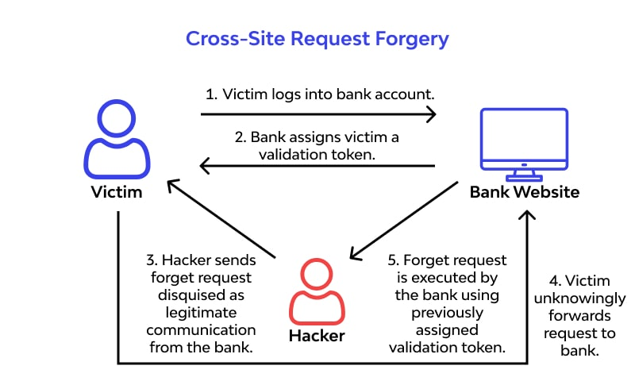

It relies on one specific behavior of web browsers: **cookies are attached automatically** to every request sent to a domain, regardless of which page or site triggered that request. So if a user is logged into `SecureBank` in one tab, and then visits a malicious page in another tab, that malicious page can silently make a request to `SecureBank` on the user's behalf; and the browser will automatically attach the user's `SecureBank` session cookie to it, making the forged request look completely legitimate to the server.

The server has no way to tell the difference between:
- A real request the user intentionally made by clicking "Update Email" on the actual dashboard, and
- A forged request silently triggered by a hidden form on a completely different, attacker-controlled page

...**unless** the server specifically checks for something the attacker's page could not have known or guessed. That "something" is a **CSRF token**.

### 2.2 What is a CSRF token, and why does it work?

A CSRF token is a long, random, unpredictable value that the server generates for a user's session and embeds inside the legitimate form as a hidden input field. When that form is submitted, the server checks that the token submitted in the request matches the token it stored for that session.

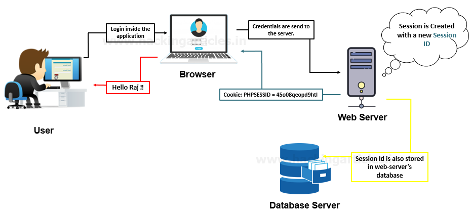

Because of the browser's **same-origin policy**, a page hosted on one origin (e.g. the attacker's site) cannot read the HTML content and therefore cannot read the hidden token; of a page hosted on a different origin (e.g. the real bank site). So while the attacker's page *can* still trigger a request and have the session cookie attached automatically, it has **no way to know or forge the correct CSRF token**. The server rejects any request with a missing or incorrect token, defeating the attack, even though the session cookie itself was valid.

**In one sentence:** *cookies prove who you are, but CSRF tokens prove you actually meant to make this specific request.*

### 2.3 Why a "Change Email" form?

A "Change Email" feature was chosen as the target because it's a simple, realistic example of a **state-changing action**; an action that modifies data on the server. CSRF is only a meaningful threat against state-changing actions (like changing an email, transferring money, changing a password, deleting an account), not against actions that simply *read* data, since forging a read-only request wouldn't give the attacker anything useful.

---

## 3. Lab Environment

| Component | Detail |
|---|---|
| Web server | Apache2 on Ubuntu (same machine used for Assignment 1) |
| Server-side language | PHP 8.1 |
| Database | MariaDB : new database `csrf_demo` |
| Vulnerable application | Custom-built "SecureBank" demo app |
| Application root | `/var/www/html/csrf-demo/` |
| Attacker's page location | `/var/www/html/attacker-site/` |
| Browser used for testing | Chrome (with DevTools) |

**Note on realism:** In a real-world CSRF attack, the attacker's malicious page would be hosted on a completely different domain (e.g. `evil-prize-site.com`), not just a different folder on the same server. For this lab, both applications were kept on `localhost` under different folder paths purely for convenience; the CSRF vulnerability and its fix behave identically either way, because what matters is that the two pages are treated as different **origins** by the browser's form-submission and cookie-handling behavior, not their literal folder location.

---

## 4. Part A : Building the Vulnerable Application

### 4.1 Creating the project folder

```bash
sudo mkdir -p /var/www/html/csrf-demo
cd /var/www/html/csrf-demo
sudo chmod 777 /var/www/html/csrf-demo
```

This created a new, separate folder for this assignment (kept apart from the DVWA installation used in Assignment 1). The `chmod 777` command was used purely to simplify file permissions while building the lab; in a real deployment this would never be used, as a world-writable directory is itself a security misconfiguration.

> `ls /var/www/html/` showing csrf-demo folder created

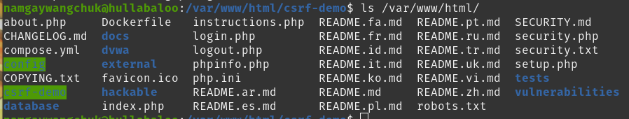

### 4.2 Setting up the database

```bash
sudo mysql
```

```sql
CREATE DATABASE csrf_demo;
CREATE USER 'csrf_user'@'localhost' IDENTIFIED BY 'csrf_pass123';
GRANT ALL PRIVILEGES ON csrf_demo.* TO 'csrf_user'@'localhost';
FLUSH PRIVILEGES;
USE csrf_demo;
CREATE TABLE users (
    id INT AUTO_INCREMENT PRIMARY KEY,
    username VARCHAR(50) NOT NULL UNIQUE,
    password VARCHAR(255) NOT NULL,
    email VARCHAR(100) NOT NULL
);
INSERT INTO users (username, password, email) VALUES ('testuser', 'password123', 'testuser@example.com');
EXIT;
```

This created a dedicated database, a database user, and a single `users` table with one demo account (`testuser` / `password123`), starting with the email `testuser@example.com`.

**Note for viva:** the password is stored in plain text here deliberately, to keep the demo focused purely on CSRF. In a real application, passwords must always be hashed (e.g. using `password_hash()` in PHP with bcrypt); that is a separate security concern from CSRF and was intentionally left out of scope for this assignment.

> Terminal showing `Query OK` for each SQL command

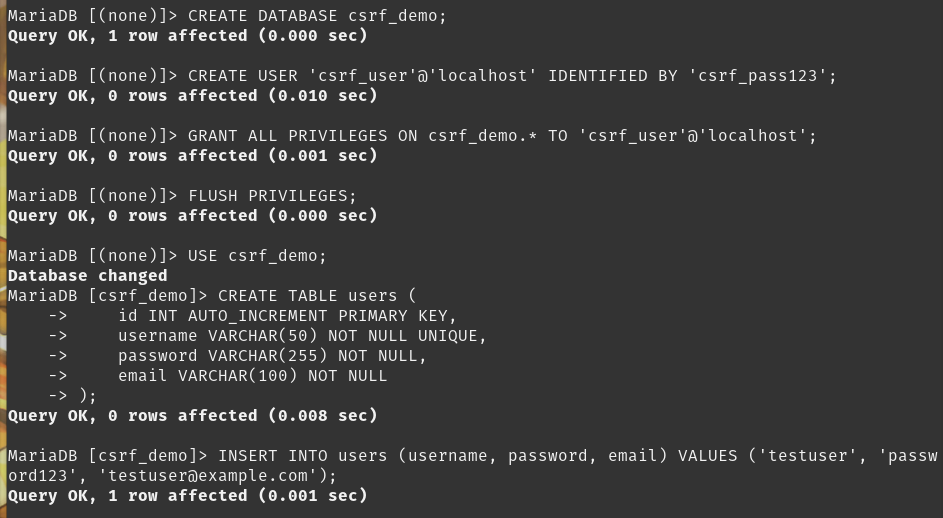

### 4.3 `db.php` : Database connection file

```php
<?php
$host = "localhost";
$db_user = "csrf_user";
$db_pass = "csrf_pass123";
$db_name = "csrf_demo";

$conn = new mysqli($host, $db_user, $db_pass, $db_name);

if ($conn->connect_error) {
    die("Connection failed: " . $conn->connect_error);
}
?>
```

This file simply opens a MySQL connection using the credentials above and exposes it as `$conn` for every other page to reuse via `include 'db.php';`. It has no direct role in CSRF; it's standard boilerplate every PHP/MySQL app needs.

> cat editor showing db.php content

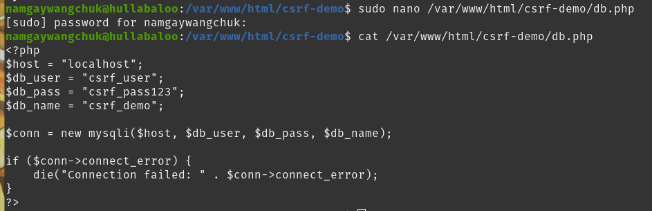


### 4.4 `login.php` : Styled login page

This page presents a login form, verifies the submitted username/password against the `users` table, and on success starts a PHP session by setting `$_SESSION['user_id']`.

**Key line for CSRF context:**
```php
$_SESSION['user_id'] = $user['id'];
```
This is the moment the browser becomes "logged in." From this point on, the browser holds a session cookie (`PHPSESSID`) that gets **automatically attached to every subsequent request to this site**; this auto-attachment is the exact browser behavior that CSRF exploits.

The full page also includes custom CSS to style it as a clean, card-based login form (blue gradient background, white card, styled inputs) rather than plain unstyled HTML, so the demo looks like a real product ("SecureBank").

> Result: the styled login page, live in the browser

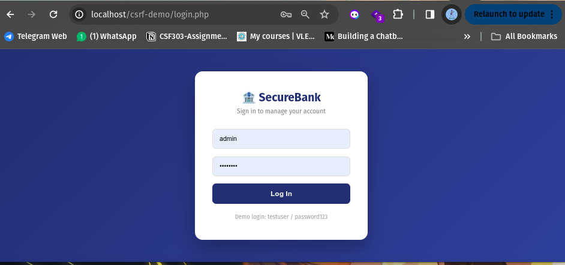

*The login page loaded at `http://localhost/csrf-demo/login.php`, showing the styled "SecureBank" login card with demo credentials displayed as a hint.*

### 4.5 `dashboard.php`: The vulnerable target page

This is the actual page containing the CSRF vulnerability. On load, it:
1. Checks that a session exists (`$_SESSION['user_id']`) : redirects to login if not.
2. If the request is a `POST` with a `new_email` field, it directly runs an `UPDATE` query to change the user's email; **with no verification that the request was intentionally submitted by the user from this page.**
3. Displays the current email and a "Change Email" form.

**The vulnerable code block:**
```php
// VULNERABLE: no CSRF token check here
if ($_SERVER["REQUEST_METHOD"] == "POST" && isset($_POST['new_email'])) {
    $new_email = $_POST['new_email'];
    $user_id = $_SESSION['user_id'];

    $stmt = $conn->prepare("UPDATE users SET email = ? WHERE id = ?");
    $stmt->bind_param("si", $new_email, $user_id);
    $stmt->execute();

    $message = "Email updated successfully!";
}
```

**Why this is vulnerable:** the server only checks that `$_SESSION['user_id']` exists (i.e., *someone* is logged in) — it never checks *where the request came from* or *whether the user intended to submit it*. Any `POST` request to this URL containing a `new_email` field, from anywhere, will succeed as long as the browser sending it has a valid session cookie.

The form itself has no hidden token field:
```php
<form method="POST" action="dashboard.php">
    <input type="email" name="new_email" placeholder="Enter new email" required>
    <button type="submit">Update Email</button>
</form>
```

> Result : the vulnerable dashboard, live and logged in

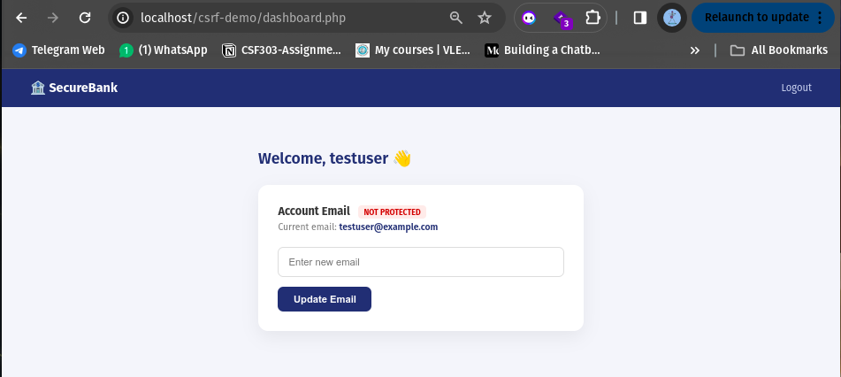

*The dashboard at `http://localhost/csrf-demo/dashboard.php`, logged in as `testuser`. Note the red "NOT PROTECTED" badge; added deliberately to visually track the vulnerable state of this form throughout the demo, and the current email showing `testuser@example.com`.*

### 4.6 `logout.php` : Session cleanup utility

```php
<?php
session_start();
session_destroy();
header("Location: login.php");
exit();
?>
```

A small utility page, destroying the session and returning to the login page. Included for completeness of the app but not directly relevant to the CSRF concept.

---

## 5. Part B : Demonstrating the Session Cookie

Before running the attack, the session cookie mechanism that CSRF relies on was inspected directly, using the browser's Developer Tools.

**Steps performed:**
1. Logged in to the dashboard as `testuser`.
2. Opened DevTools (`F12`) → **Application** tab → **Storage → Cookies → `http://localhost`**.
3. Located the `PHPSESSID` cookie and its value.

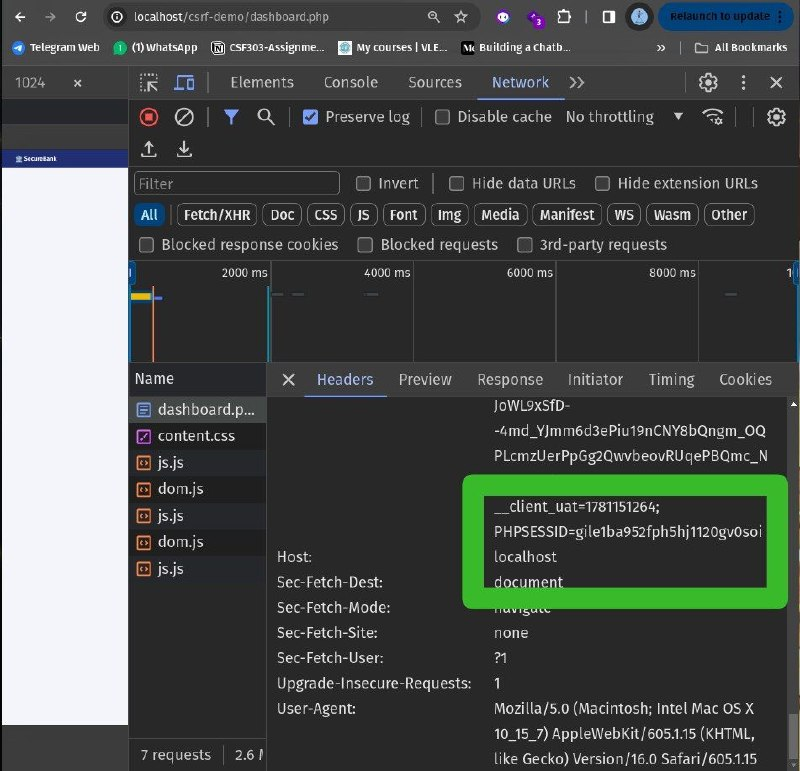

*DevTools → Application → Cookies, showing the `PHPSESSID` cookie issued to the browser after login. This cookie is what the browser automatically attaches to every subsequent request to `localhost`; including requests triggered by a completely different, malicious page. This is the underlying mechanism that makes CSRF possible.*

---

## 6. Part C : Building and Running the Attack

### 6.1 `prize.php` : The attacker's malicious page

This page was built to simulate a malicious third-party site (in a real attack, this would be hosted on a completely separate domain, e.g. `free-prize-now.com`). It was placed in a separate folder, `/var/www/html/attacker-site/`, to represent this separation.

**The page has two parts:**

**1. A visible decoy** : an innocent-looking "You Won a Prize!" card, styled to look harmless and distract the victim.

**2. A hidden CSRF attack form**, which auto-submits the instant the page loads:
```php
<!-- HIDDEN CSRF ATTACK FORM -->
<form id="csrf-form" action="http://localhost/csrf-demo/dashboard.php" method="POST" style="display:none;">
    <input type="email" name="new_email" value="hacked@attacker.com">
</form>

<script>
    // Auto-submits the hidden form the instant this page loads
    document.getElementById('csrf-form').submit();
</script>
```

**How this works, step by step:**
1. The `<form>` tag targets `dashboard.php` on the real site directly; even though this HTML is being served from a completely different page/folder.
2. The `new_email` field is pre-filled with the attacker's chosen value, `hacked@attacker.com`; the victim never sees or types this.
3. The `<script>` block calls `.submit()` on that hidden form the instant the page's JavaScript runs; no click, no user interaction required at all.
4. Because the victim's browser already holds a valid `PHPSESSID` cookie for `localhost` (from being logged into SecureBank), that cookie gets **automatically attached** to this forged `POST` request, exactly as it would for a legitimate request from the real dashboard.
5. The server has no way to distinguish this forged request from a real one; it sees a valid session and a `new_email` field, and processes the update.

> Nano editor showing prize.php code, especially the hidden form and script

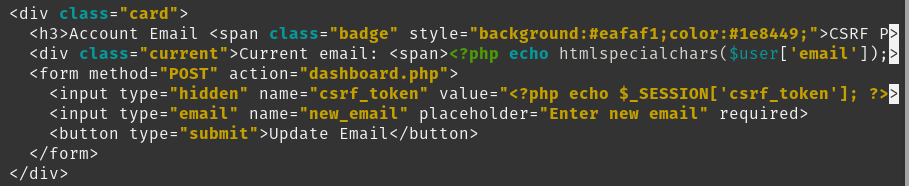

### 6.2 Running the attack

**Step 1:** Confirmed the victim is logged in on the vulnerable dashboard, with the original email `testuser@example.com` visible (see Section 4.5 screenshot above).

**Step 2:** With DevTools' Network tab open and filtered to `dashboard`, navigated to the attacker's page:
```
http://localhost/attacker-site/prize.php
```

**Step 3:** Inspected the resulting network request in DevTools:

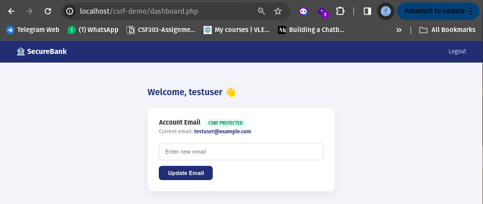


*DevTools → Network tab, showing the `dashboard.php` request that was automatically triggered by the hidden form on `prize.php`. The Request Headers clearly show `Cookie: ... PHPSESSID=gile1ba952fph5hj1120gv0soi`; proving the browser silently attached the victim's valid session cookie to a request that originated from the attacker's page. Also note `Sec-Fetch-Mode: navigate`, confirming this was a real top-level page navigation (the form auto-submitting), not a background AJAX call.*

**Step 4:** Navigated back to the dashboard to check the outcome:

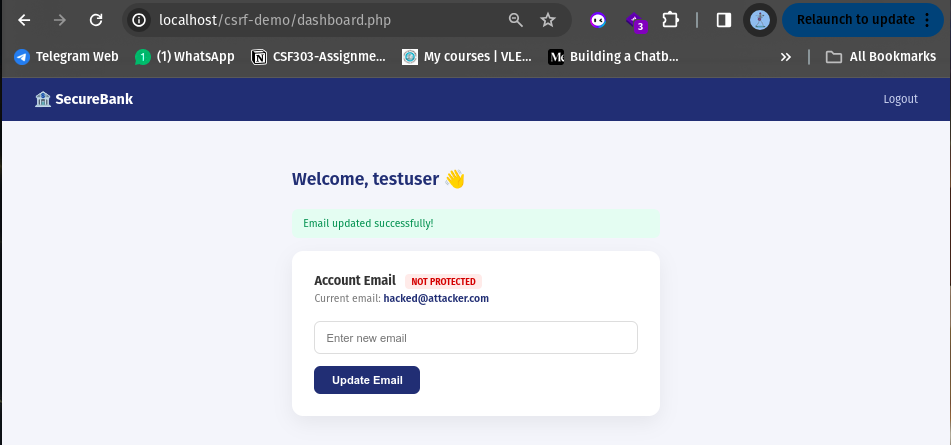

*The dashboard now shows the current email as `hacked@attacker.com`; the attacker's page successfully changed the victim's account email without the victim ever knowingly submitting that change. This confirms the CSRF attack succeeded against the unprotected form.*

### 6.3 Summary of the attack

| Step | What happened |
|---|---|
| 1 | Victim logs into SecureBank normally, receives a session cookie |
| 2 | Victim visits an unrelated, innocent-looking page (`prize.php`) in another tab |
| 3 | That page's hidden form silently submits a forged request to `dashboard.php` |
| 4 | Browser automatically attaches the victim's session cookie to this forged request |
| 5 | Server sees a valid session and processes the request as legitimate |
| 6 | Victim's email is changed to a value they never entered, with no visible warning |

---

## 7. Part D : Implementing the Fix (CSRF Tokens)

### 7.1 Resetting the demo data

```bash
sudo mysql
```
```sql
USE csrf_demo;
UPDATE users SET email = 'testuser@example.com' WHERE username = 'testuser';
EXIT;
```

This reset the email back to its original value, so the fixed version could be tested cleanly from the same starting point as the vulnerable version.

### 7.2 Changes made to `dashboard.php`

**Change 1 : Generate a CSRF token per session**, added immediately after `session_start();`:
```php
session_start();
include 'db.php';

// Generate a CSRF token if one doesn't already exist for this session
if (empty($_SESSION['csrf_token'])) {
    $_SESSION['csrf_token'] = bin2hex(random_bytes(32));
}
```
`random_bytes(32)` generates 32 bytes (256 bits) of cryptographically secure random data, and `bin2hex()` converts it into a readable hexadecimal string. This token is generated once per session and stored server-side in `$_SESSION`, never exposed anywhere the attacker's page could read it.

**Change 2 : Validate the token before processing the form:**
```php
// FIXED: validate CSRF token before processing
if ($_SERVER["REQUEST_METHOD"] == "POST" && isset($_POST['new_email'])) {
    if (!isset($_POST['csrf_token']) || $_POST['csrf_token'] !== $_SESSION['csrf_token']) {
        $message = "⚠️ Request blocked: Invalid or missing CSRF token.";
    } else {
        $new_email = $_POST['new_email'];
        $user_id = $_SESSION['user_id'];

        $stmt = $conn->prepare("UPDATE users SET email = ? WHERE id = ?");
        $stmt->bind_param("si", $new_email, $user_id);
        $stmt->execute();

        $message = "✅ Email updated successfully!";
    }
}
```
The `!==` comparison is a strict comparison in PHP (checks both value and type), which is intentionally used here to avoid subtle comparison bugs. If the submitted `csrf_token` is missing entirely, or doesn't exactly match the one stored in the session, the update is blocked and a warning message is shown instead.

**Change 3 : Embed the token as a hidden field in the legitimate form:**
```php
<form method="POST" action="dashboard.php">
    <input type="hidden" name="csrf_token" value="<?php echo $_SESSION['csrf_token']; ?>">
    <input type="email" name="new_email" placeholder="Enter new email" required>
    <button type="submit">Update Email</button>
</form>
```
The badge on the page was also updated from a red "NOT PROTECTED" label to a green "CSRF PROTECTED" label, to visually track the change in state.

**Why this fix works:** the attacker's `prize.php` page has no way to read `$_SESSION['csrf_token']`; it exists only in the server's session storage and inside the HTML of the legitimate `dashboard.php` page, which the attacker's separate-origin page cannot access due to the browser's same-origin policy. This means the attacker's forged form can never include a valid `csrf_token` value, so the server's check on Change 2 catches and blocks it every time, even though the forged request still carries a perfectly valid session cookie.

---

## 8. Part E : Re-Testing the Attack After the Fix

### 8.1 Confirming the fix is in place


*The dashboard, reloaded after the fix. The badge now reads "CSRF PROTECTED" (green), and the current email is back to `testuser@example.com` following the reset in Section 7.1.*

### 8.2 Confirming the token is actually present in the page

Using **View Page Source** (`Ctrl+U`) and searching for `csrf_token`:

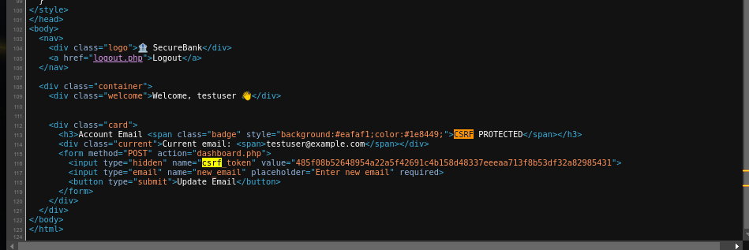

*The page's HTML source, confirming the hidden input field `<input type="hidden" name="csrf_token" value="485f08b52648954a22a5f42691c4b158d48337eeeaa713f8b53df32a82985431">` is present in the legitimate form; this is the secret value the attacker's page has no way of knowing.*

### 8.3 Re-running the exact same attack

The exact same steps from Section 6.2 were repeated; visiting `http://localhost/attacker-site/prize.php` while logged in, with its unchanged hidden form still auto-submitting to `dashboard.php`.

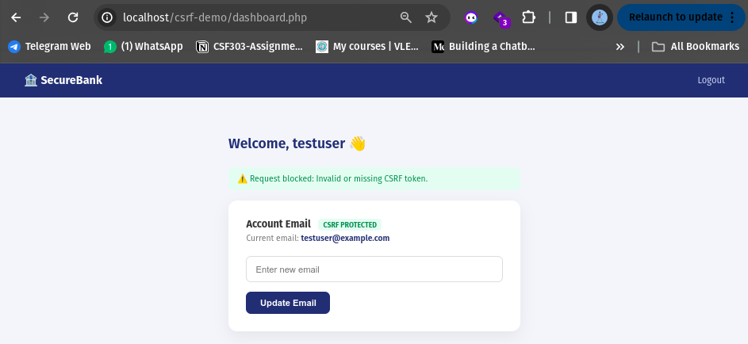

*Result: the dashboard now displays the warning message "⚠️ Request blocked: Invalid or missing CSRF token." The email remains `testuser@example.com`, completely unchanged. The identical attack that succeeded in Section 6 is now fully blocked.*

**Why it failed this time:** the attacker's form still auto-submits and the browser still attaches a valid session cookie; but the forged request has no `csrf_token` field at all (since the attacker's page could not read the value from the real page's HTML). The server's validation check on the fixed `dashboard.php` catches this mismatch and rejects the request before the database update ever runs.

---

## 9. Before vs. After : Summary Table

| Aspect | Vulnerable Version | Fixed Version |
|---|---|---|
| Form contains a CSRF token | No | Yes; random 256-bit token per session |
| Server validates request origin/intent | No; only checks session validity | Yes; checks token match before processing |
| Result of attacker's forged request | ✅ Succeeds; email changed to `hacked@attacker.com` | ❌ Blocked; warning shown, email unchanged |
| Session cookie still sent by browser | Yes | Yes (this alone was never the problem) |
| Root cause addressed | — | Server now verifies the *request itself* was intentional, not just that *a session* exists |

---

## 10. Conclusion

This assignment demonstrated, end-to-end, how a Cross-Site Request Forgery attack works and why it succeeds against a form that only relies on session cookies for authentication. By building both the vulnerable and the fixed versions of the same application, and running the identical attack against both, it was possible to directly observe:

1. That a browser automatically attaches session cookies to requests regardless of which page triggered them; this is the root mechanism CSRF abuses, and it is normal, expected browser behavior, not a bug.
2. That checking only "is this user logged in?" is not sufficient to protect a state-changing action; the server must also verify that the specific request was intentionally initiated by the user, from the legitimate page.
3. That a CSRF token, generated randomly per session and embedded only in the legitimate page's HTML, provides an effective defense, because the browser's same-origin policy prevents an attacker's page from reading that token; even though it can still trigger requests and have cookies attached to them.

**Key takeaway for viva:** CSRF protection is not about hiding or protecting the session cookie itself; the cookie is still sent either way. It is about proving that the *request* was intentional, using a secret value the attacker's page has no way to obtain.

---

## 11. Tools and Technologies Used

- **PHP 8.1** with **MySQLi** — server-side application logic
- **MariaDB** — database backend
- **Apache2** — web server (Ubuntu)
- **Google Chrome DevTools** — inspecting session cookies and network requests
- **HTML/CSS/JavaScript** — front-end styling and the attacker's auto-submitting form

---

*End of Report*
