# File Upload Vulnerability : Demonstration and Mitigation Report

**Assignment 03:** Develop a file upload feature and implement security measures to prevent malicious file uploads.
**Syllabus reference:** Unit II; Server Side Attacks, Section 2.3 (File Upload Vulnerability)

---

## 1. Objective

The objective of this assignment is to:

1. Build a realistic web application feature that accepts file uploads from a user (a "Profile Picture Upload" form), with **no security validation** on the uploaded file.
2. Demonstrate a working attack against this feature; uploading a malicious script disguised as (or simply submitted as) a normal file, and executing it to achieve **arbitrary remote code execution (RCE)** on the server.
3. Fix the vulnerability by implementing multiple, independent layers of file validation, and demonstrate that the same attack; including a more advanced disguised version of it now fails.

This directly maps to the three subtopics of Section 2.3 in the course syllabus:
- **2.3.1 Malicious file uploads**: the attack demonstration in Part C
- **2.3.2 File type and content validation**: the extension whitelist and real MIME-type check in Part D
- **2.3.3 Secure file handling practices**: file size limits and random filename generation in Part D

---

## 2. Background

### 2.1 What is a File Upload Vulnerability?

A file upload vulnerability exists when a web application allows users to upload files without properly verifying **what** is actually being uploaded. If the application blindly trusts the file's name, extension, or the browser-supplied content-type, an attacker can upload an executable script (such as a PHP file) instead of the expected file type (such as an image).

If that uploaded file is saved in a location the web server is configured to execute; which is the default behavior for any `.php` file inside a typical Apache + PHP web root; the attacker can then simply visit the file's URL in a browser, and the web server will **run the attacker's code directly on the server**, exactly as if it were a normal page of the application. This is one of the most severe classes of web vulnerabilities, since it can lead to full compromise of the server, not just the specific feature being attacked.

### 2.2 Why extension checking alone is not enough

A common but flawed defense is to only check a file's **extension** (e.g., rejecting anything that isn't `.jpg`, `.png`, etc.). This is insufficient on its own because:

- An attacker can simply **rename** a malicious file (e.g., `shell.php` → `shell.jpg`) to pass a naive extension check, while the file's actual *content* remains executable PHP code.
- Depending on server configuration, some servers can be tricked into executing files with double extensions (e.g., `shell.php.jpg`) or unusual casing (`shell.PHP`).

This is exactly why the course syllabus separates **"file type"** from **"content" validation** (Section 2.3.2); a secure implementation must check both the claimed extension *and* the actual bytes of the file to determine what it really is.

### 2.3 What is a "web shell"?

A **web shell** is a small script, often just a few lines; that, once placed on a server in a location the server will execute, allows an attacker to run arbitrary operating system commands through a web browser, by passing the desired command as a URL parameter. It is one of the most common payloads delivered through file upload vulnerabilities, because it gives the attacker persistent, interactive control over the server with minimal effort.

### 2.4 Defense-in-depth for file uploads

A properly secured file upload feature does not rely on a single check. The approach demonstrated in this assignment uses **five independent layers**, so that even if one check were somehow flawed or bypassed, the others would still catch a malicious file:

| Layer | What it checks |
|---|---|
| Upload error check | Whether the file transferred correctly at all |
| File size limit | Rejects abnormally large files |
| Extension whitelist | Rejects anything not `.jpg`, `.jpeg`, `.png`, `.gif` by name |
| Real MIME-type check | Inspects the actual bytes of the file to determine its true content type, independent of its name |
| Image structure validation | Attempts to actually parse the file as an image; a non-image will fail even if it passed the MIME check |
| Random filename generation | Prevents the attacker from controlling or predicting the final filename/path, even for content that does pass all checks |

---

## 3. Lab Environment

| Component | Detail |
|---|---|
| Web server | Apache2 on Ubuntu (same machine used in prior assignments) |
| Server-side language | PHP 8.1 |
| Application | Custom-built "SecureBank — Profile Picture Upload" feature |
| Application root | `/var/www/html/upload-demo/` |
| Upload storage folder | `/var/www/html/upload-demo/uploads/` |
| Browser used for testing | Chrome |

**Note on scope:** Unlike the CSRF assignment, this feature was built without a login/session system, since the file upload vulnerability itself has nothing to do with authentication; the vulnerability and its fix behave identically whether or not the user is logged in. Keeping the demo focused purely on file-handling logic keeps the evidence and explanation clean and directly tied to the syllabus topic.

---

## 4. Part A : Building the Application

### 4.1 Creating the project folder

```bash
sudo mkdir -p /var/www/html/upload-demo
sudo mkdir -p /var/www/html/upload-demo/uploads
cd /var/www/html/upload-demo
sudo chmod 777 /var/www/html/upload-demo
sudo chmod 777 /var/www/html/upload-demo/uploads
```

This created the application folder and a dedicated `uploads/` subfolder to store uploaded files. `chmod 777` was used purely to simplify permissions while building the lab; it is not a practice appropriate for a real deployment.

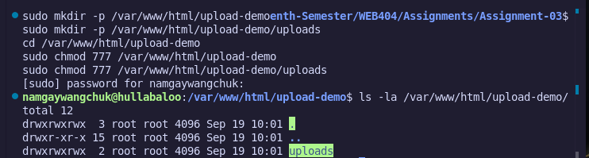

*Terminal output confirming both `upload-demo/` and its nested `uploads/` subfolder were created successfully with the expected permissions.*

### 4.2 Building the (initially) vulnerable upload form : `upload.php`

The first version of the application was built with **zero validation** on the uploaded file, to establish a clear baseline for the attack that follows.

**The vulnerable code:**
```php
<?php
$message = "";

// VULNERABLE: no validation on file type, content, or size
if ($_SERVER["REQUEST_METHOD"] == "POST" && isset($_FILES['profile_pic'])) {
    $file = $_FILES['profile_pic'];
    $target_path = "uploads/" . $file['name'];

    if (move_uploaded_file($file['tmp_name'], $target_path)) {
        $message = "File uploaded successfully: " . htmlspecialchars($file['name']);
    } else {
        $message = "Upload failed.";
    }
}

$uploaded_files = array_diff(scandir('uploads'), array('.', '..'));
?>
```
(Full file also includes styled HTML/CSS for a "SecureBank" branded interface, and a list displaying all previously uploaded files as clickable links.)

**Why this is vulnerable:** the code takes the file's original name directly from user input (`$file['name']`), performs no check on its extension or actual content, and no check on its size; then saves it directly into a folder that Apache will happily execute as PHP, since there is no server configuration telling it otherwise.

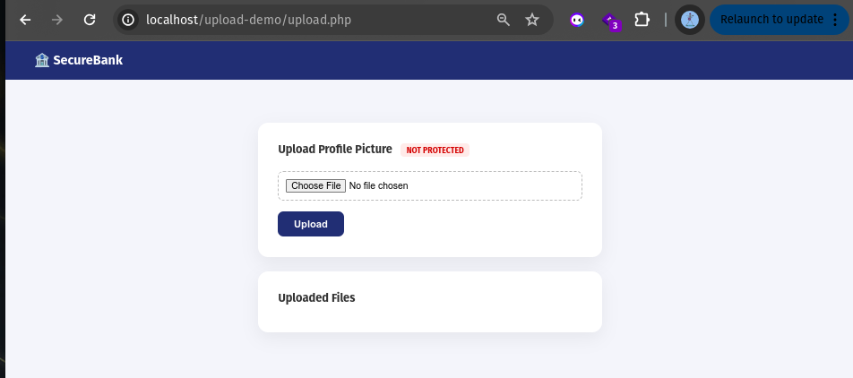

*The vulnerable upload form, live in the browser at `http://localhost/upload-demo/upload.php`. Note the red "NOT PROTECTED" badge, added deliberately to visually track the security state of the form throughout this demonstration.*

### 4.3 Confirming normal functionality first

Before attacking the application, a legitimate image file was uploaded to confirm the basic feature works as intended.

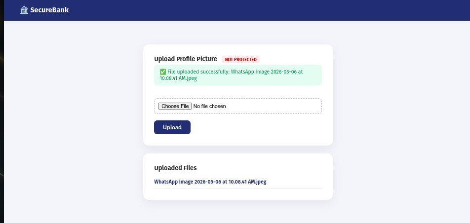

*A real `.jpeg` image uploaded successfully, appearing as a clickable link under "Uploaded Files"; confirming the core upload mechanism functions correctly before any attack is attempted.*

---

## 5. Part B : Building the Malicious Payload (Web Shell)

A simple PHP web shell was created to demonstrate remote code execution once uploaded:

```php
<?php
if (isset($_GET['cmd'])) {
    echo "<pre>";
    system($_GET['cmd']);
    echo "</pre>";
} else {
    echo "Upload successful. Usage: ?cmd=whoami";
}
?>
```

**How it works:** if a `cmd` parameter is present in the URL, the script passes its value directly to PHP's `system()` function, which executes it as an operating system command and prints the output back to the browser. If no `cmd` parameter is given, it simply displays a usage hint.

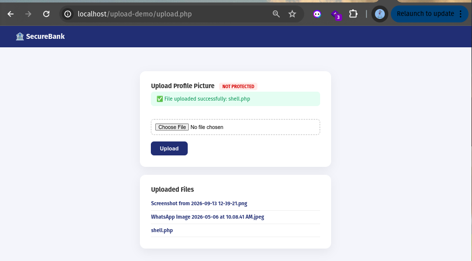

*The malicious `shell.php` file's content, confirmed via `cat` before uploading it, showing the complete web shell logic.*

---

## 6. Part C : Demonstrating the Attack (Malicious File Uploads; Syllabus 2.3.1)

### 6.1 Uploading the malicious file

The `shell.php` file was uploaded through the vulnerable form exactly as any normal file would be — no disguise was even necessary, since the vulnerable code performs no validation whatsoever.

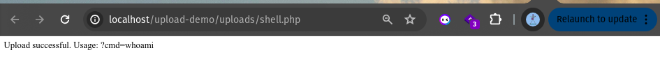

*The server accepted `shell.php` without any resistance, saving it directly under `uploads/` and listing it as a normal uploaded file; proving there is no file type validation in place at all.*

### 6.2 Executing the uploaded shell

Visiting the uploaded file directly in the browser confirmed the shell was live and executable:

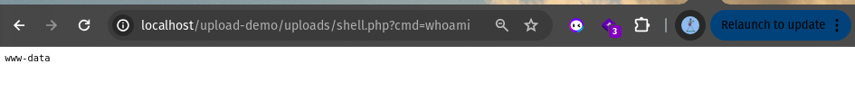

*Navigating to `http://localhost/upload-demo/uploads/shell.php` executes the uploaded PHP file directly, returning the usage hint defined in the script; proof that Apache is treating this uploaded file as executable code, not as a static file.*

### 6.3 Achieving remote code execution

With the shell confirmed live, several operating system commands were executed through it via the `cmd` URL parameter:

**Command: `whoami`**

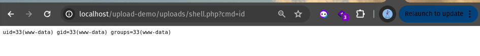

*Returns `www-data`; the system user that the Apache web server process runs as. This confirms arbitrary commands are executing with the web server's own privileges.*

**Command: `id`**


*Returns full identity information: `uid=33(www-data) gid=33(www-data) groups=33(www-data)`; further confirming the level of access gained.*

**Command: `ls -la /var/www/html`**

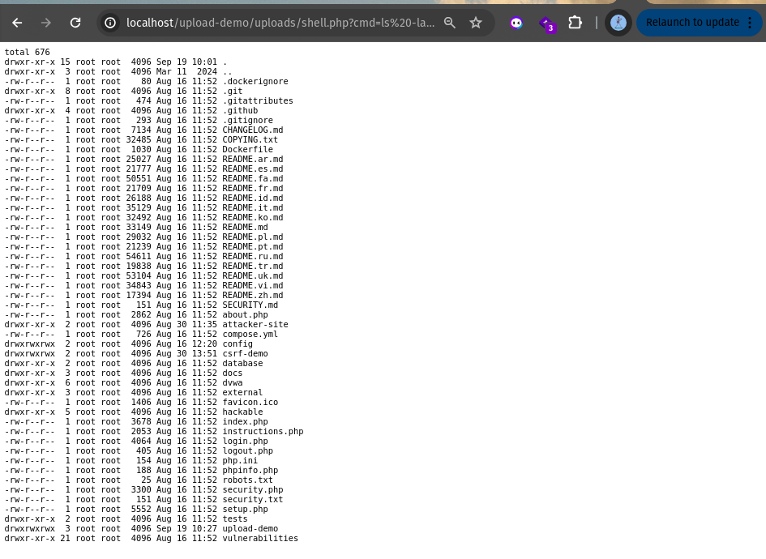

*Returns a complete directory listing of the entire web root; not just the upload-demo application, but every other folder on the server, including files and folders belonging to entirely separate assignments (`csrf-demo`, `dvwa`, `attacker-site`). This demonstrates that a single unvalidated file upload vulnerability can expose the entire server, not just the vulnerable feature itself.*

**Command: `cat /etc/passwd`**

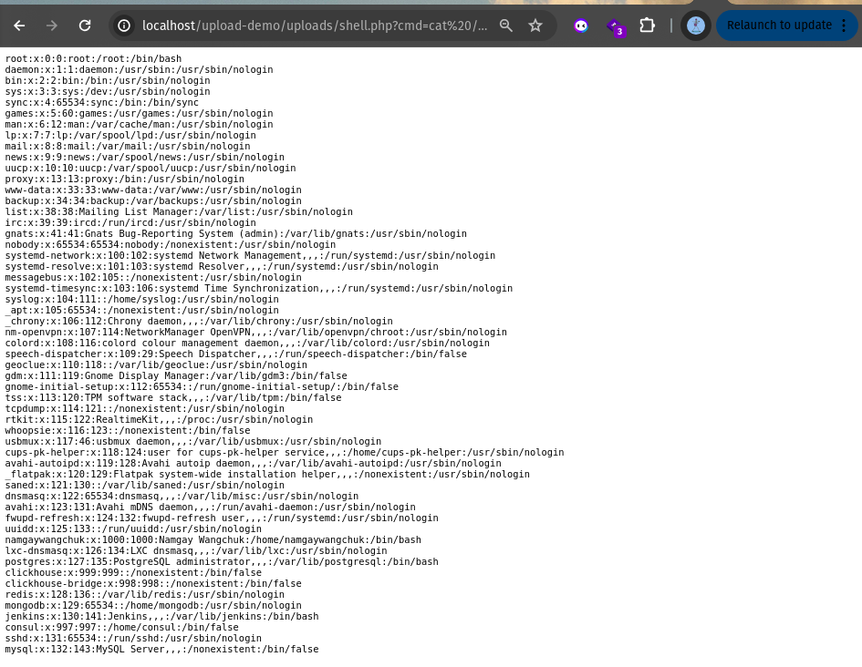

*Returns the full contents of the system's user account list (`/etc/passwd`), a file that should never be accessible to a remote, unauthenticated user. This is a severe information disclosure, made possible entirely through the file upload vulnerability.*

### 6.4 Summary of the attack

| Step | What happened |
|---|---|
| 1 | Attacker crafts a small PHP script (`shell.php`) that executes OS commands |
| 2 | Attacker uploads it through the "Profile Picture Upload" form — no validation blocks it |
| 3 | The file is saved directly into a publicly accessible, PHP-executable folder |
| 4 | Attacker visits the file's URL directly, triggering server-side execution |
| 5 | Attacker runs arbitrary commands (`whoami`, `id`, `ls`, `cat`) through the `cmd` parameter |
| 6 | Attacker gains visibility into the entire web root and sensitive system files |

**Severity:** Critical. This is not limited to defacing the application or corrupting one feature; it grants the attacker a persistent, interactive foothold on the underlying server itself.

---

## 7. Part D : Implementing the Fix (Type and Content Validation, Secure File Handling; Syllabus 2.3.2 & 2.3.3)

### 7.1 The fixed code

```php
<?php
$message = "";

// FIXED: multiple layers of validation before accepting the file
if ($_SERVER["REQUEST_METHOD"] == "POST" && isset($_FILES['profile_pic'])) {
    $file = $_FILES['profile_pic'];

    // 1. Check for upload errors first
    if ($file['error'] !== UPLOAD_ERR_OK) {
        $message = "Upload error occurred.";
    }
    // 2. Enforce a file size limit (2MB)
    elseif ($file['size'] > 2 * 1024 * 1024) {
        $message = "File too large. Maximum size is 2MB.";
    }
    else {
        // 3. Whitelist allowed extensions
        $allowed_ext = ['jpg', 'jpeg', 'png', 'gif'];
        $ext = strtolower(pathinfo($file['name'], PATHINFO_EXTENSION));

        // 4. Verify the REAL MIME type by inspecting file content, not just trusting the extension
        $allowed_mime = ['image/jpeg', 'image/png', 'image/gif'];
        $finfo = finfo_open(FILEINFO_MIME_TYPE);
        $real_mime = finfo_file($finfo, $file['tmp_name']);
        finfo_close($finfo);

        // 5. Double-check it's actually a valid, parseable image
        $image_check = @getimagesize($file['tmp_name']);

        if (!in_array($ext, $allowed_ext)) {
            $message = "Blocked: file extension \".$ext\" is not allowed.";
        } elseif (!in_array($real_mime, $allowed_mime)) {
            $message = "Blocked: actual file content is \"$real_mime\", not a valid image.";
        } elseif ($image_check === false) {
            $message = "Blocked: file failed image validation (not a real image).";
        } else {
            // 6. Never trust the original filename — generate a new random one
            $safe_name = bin2hex(random_bytes(8)) . "." . $ext;
            $target_path = "uploads/" . $safe_name;

            if (move_uploaded_file($file['tmp_name'], $target_path)) {
                $message = "File uploaded successfully as: " . htmlspecialchars($safe_name);
            } else {
                $message = "Upload failed.";
            }
        }
    }
}
?>
```

The page's badge was also updated from a red "NOT PROTECTED" label to a green "PROTECTED" label, to visually track the state change.

### 7.2 Explanation of each validation layer

| # | Check | Syllabus mapping | Why it matters |
|---|---|---|---|
| 1 | Upload error check | 2.3.3 Secure handling | Catches PHP-level transfer failures early, before any file processing occurs |
| 2 | File size limit (2MB) | 2.3.3 Secure handling | Prevents denial-of-service via abnormally large uploads |
| 3 | Extension whitelist | 2.3.2 Type validation | Rejects files by name alone; the first, simplest line of defense |
| 4 | Real MIME-type check (`finfo_file`) | 2.3.2 Content validation | Inspects the file's actual bytes (its "magic number"/signature), independent of what the filename claims to be; this is what catches a renamed `.php` file |
| 5 | Image structure validation (`getimagesize`) | 2.3.2 Content validation | Attempts to genuinely parse the file as an image; a non-image will fail this even if its declared MIME type happened to look correct |
| 6 | Random filename generation | 2.3.3 Secure handling | Ensures the attacker can never predict or control the final saved filename or path, removing a class of follow-up attacks even for content that does pass validation |

**Why checking both type (extension) and content (real bytes) matters:** an extension check alone can be defeated simply by renaming a file. A malicious PHP script renamed to `shell.jpg` would pass an extension-only check, but its actual byte content is still PHP source code; a `finfo_file()` inspection of that content correctly identifies it as `text/x-php` regardless of what its filename claims, and the upload is rejected. This is the precise distinction the syllabus draws between "file type" and "content" validation.

### 7.3 Resetting to a clean state before re-testing

Before demonstrating the fix, the leftover files from the earlier attack (the malicious `shell.php` and prior test images) were removed, and the fix was confirmed live:

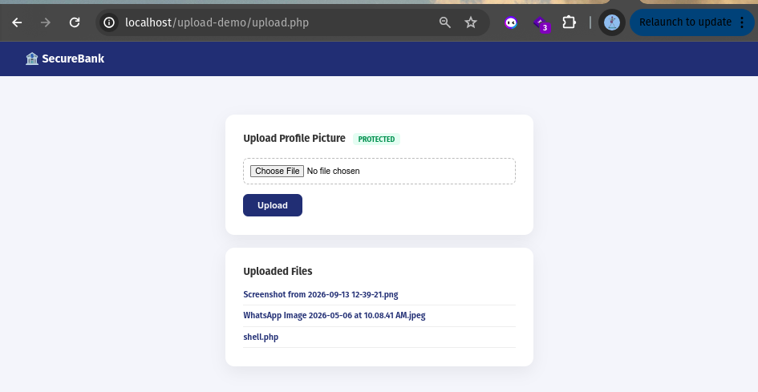

*The dashboard reloaded after applying the fix, now showing the green "PROTECTED" badge. Old files from the vulnerable-version testing are still visible in this shot, prior to cleanup.*

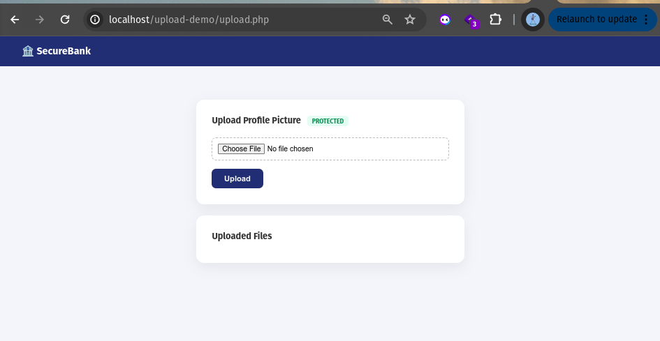

*After removing the old test files from the server, the "Uploaded Files" list is now empty, giving a clean starting point to fairly re-test the fixed version.*

---

## 8. Part E — Re-Testing the Attack After the Fix

### 8.1 Confirming legitimate uploads still work

A real image file was uploaded again to confirm the fix does not break normal functionality:

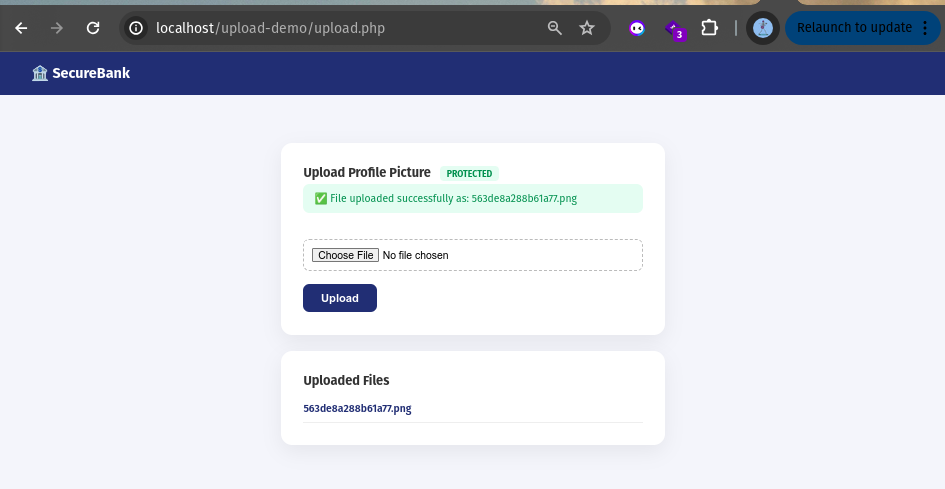

*The image uploaded successfully, but note the filename shown is now a random hexadecimal string (`563de8a288b61a77.png`) rather than the original filename; confirming the random filename generation (Layer 6) is active, in addition to the file having passed every validation check.*

### 8.2 Re-attempting the original attack

The exact same `shell.php` file used in the successful attack (Section 6) was uploaded again:

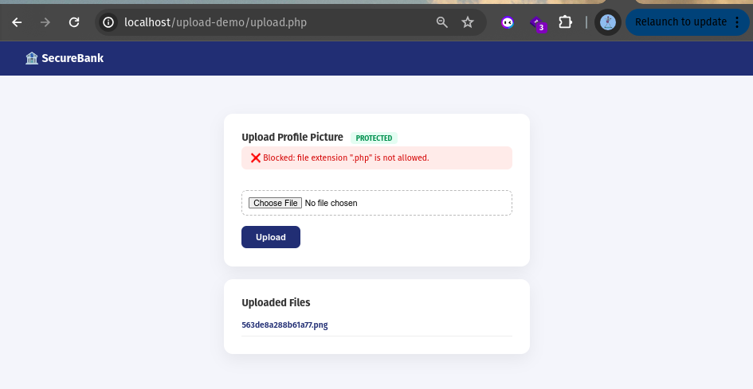

*Result: `Blocked: file extension ".php" is not allowed.` The extension whitelist (Layer 3) catches this immediately; the same file that previously achieved full remote code execution is now rejected before it ever touches the filesystem.*

### 8.3 The stronger test; disguising the shell as an image

To specifically test the **content** validation layer (not just the extension check), the malicious file was renamed to disguise it as an image:

```bash
cp ~/Desktop/shell.php ~/Desktop/shell_disguised.jpg
```

This file now has a `.jpg` extension — which would pass a naive, extension-only check — but its actual byte content remains unchanged PHP source code.

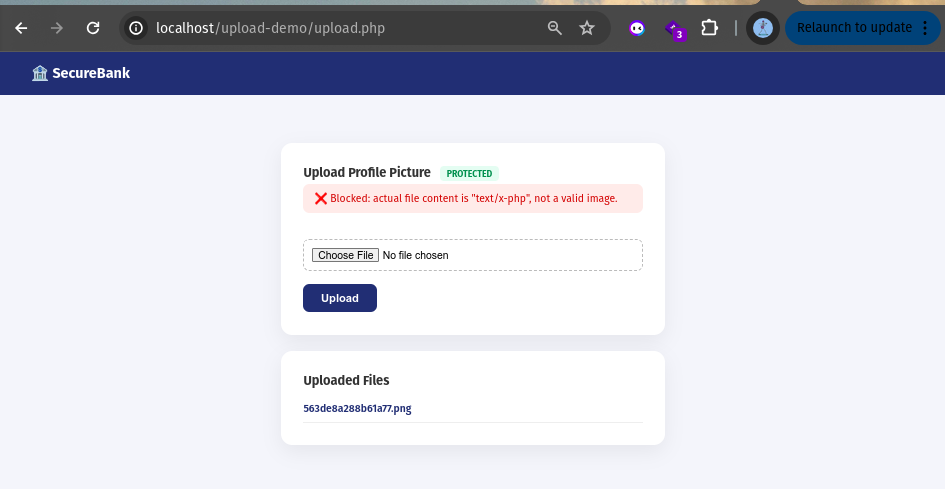

*Result: `Blocked: actual file content is "text/x-php", not a valid image.` Despite successfully disguising the file's extension, the real MIME-type check (Layer 4) correctly identifies the true nature of the file's content and blocks it. This is the single most important piece of evidence in this report, as it directly demonstrates why extension-based checking alone is insufficient, and why the syllabus explicitly separates "type" from "content" validation.*

### 8.4 Summary of the fix's effectiveness

| Test | Vulnerable version | Fixed version |
|---|---|---|
| Legitimate image upload | Succeeds | Succeeds (with randomized filename) |
| Raw `shell.php` upload | Succeeds; leads to full RCE | Blocked; extension whitelist |
| `shell.php` renamed to `.jpg` | *(not tested against vulnerable version; extension alone would still have been irrelevant, since no checks existed at all)* | Blocked; real content/MIME-type check |
| Original filename preserved | Yes; attacker-controlled | No; server-generated random name |

---

## 9. Before vs. After — Overall Comparison

| Aspect | Vulnerable Version | Fixed Version |
|---|---|---|
| File extension checked | No | Yes; whitelist of `jpg`, `jpeg`, `png`, `gif` |
| Actual file content checked | No | Yes; real MIME-type via `finfo_file()` |
| Image structure verified | No | Yes; via `getimagesize()` |
| File size limited | No | Yes; 2MB maximum |
| Original filename trusted | Yes; directly used to save the file | No; replaced with a random, unpredictable name |
| Result of uploading a PHP web shell | Succeeds; full remote code execution achieved | Blocked at multiple independent layers |
| Result of a renamed/disguised PHP shell | Would have succeeded (no checks existed) | Still blocked; content check is independent of filename |

---

## 10. Conclusion

This assignment demonstrated, end-to-end, how an unvalidated file upload feature can lead directly to full remote code execution on a web server — not through any complex exploit technique, but simply because the application trusted a file's name and extension without ever inspecting what it actually contained. By uploading a small PHP web shell and executing operating system commands through it, it was shown that the impact of this vulnerability extends far beyond the specific upload feature itself, exposing the entire web root and sensitive system files.

The fix applied five independent validation layers rather than a single check, directly reflecting the course syllabus's distinction between validating a file's **claimed type** (its extension) and its **actual content** (its real bytes, verified through MIME-type inspection and image-structure parsing). Re-testing confirmed that:

1. The original attack (uploading a raw `.php` file) is now blocked at the extension-whitelist stage.
2. A more sophisticated version of the same attack; disguising the malicious file with an image extension; is still blocked, this time by the content-based check, proving that the fix does not rely on filename trust at any point.
3. Legitimate functionality (uploading real images) continues to work correctly, with the added protection of server-generated random filenames.

**Key takeaway for viva:** a secure file upload feature cannot rely on checking a file's name or extension alone, since these are entirely controlled by the attacker and can be trivially forged. Genuine security requires inspecting the actual content of the file; what it *is*, not what it *claims to be*; combined with never trusting attacker-supplied filenames when saving the file to disk.

---

## 11. Tools and Technologies Used

- **PHP 8.1** : `finfo_file()`, `getimagesize()`, `move_uploaded_file()`, `random_bytes()`
- **Apache2** : web server (Ubuntu), executing uploaded PHP files by default
- **Google Chrome** : testing the application and directly invoking the uploaded web shell
- **HTML/CSS** : front-end styling for the "SecureBank" themed interface

---
