# SQL Injection : Vulnerability Demonstration and Mitigation Report

**Assignment:** Set up a vulnerable web application and perform various types of SQL injection attacks.
**Syllabus reference:** Unit II ; Server Side Attacks, Section 2.1 (SQL Injection)

---

## 1. Objective

The objective of this assignment is to:

1. Reuse an already-deployed vulnerable web application (**DVWA : Damn Vulnerable Web Application**) as a safe, legal target.
2. Demonstrate **three distinct types of SQL injection** against it: a logic-based/authentication-bypass injection, a UNION-based data-extraction injection, and a boolean-based blind injection.
3. Examine the underlying PHP source code to explain precisely *why* each attack succeeds.
4. Demonstrate the fix; **parameterized queries (prepared statements)** combined with input validation and confirm the identical attacks now fail against the corrected code.

---

## 2. Background : Key Concepts

### 2.1 What is SQL Injection?

**SQL Injection (SQLi)** is a vulnerability that occurs when user-supplied input is inserted directly into a SQL query string without being properly separated from the query's actual code. Because a database has no inherent way to distinguish between "this is data the user typed" and "this is SQL syntax," if an application builds its queries by concatenating raw user input into a string, an attacker can supply input that is itself valid SQL syntax and the database will execute it as part of the intended query.

The consequences range from bypassing authentication, to reading data the application was never designed to expose, and in severe cases; modifying or deleting data, or even executing operating-system commands, depending on the database's configuration and privileges.

### 2.2 Types of SQL Injection Demonstrated in This Report

**1. Logic-based / Authentication Bypass Injection**
The simplest form: injecting SQL syntax that manipulates a query's `WHERE` clause so that its condition becomes permanently true (or false), regardless of the actual data being searched for. The classic example is `' OR '1'='1`, which turns a query intended to match a single specific row into one that matches every row.

**2. UNION-Based Injection**
A more powerful technique that uses SQL's `UNION` operator to append a second, attacker-controlled query onto the original one. If the number of columns is matched correctly, this allows the attacker to pull data from **any other table in the database**; not just the one the original query was designed to access directly into the application's normal output.

**3. Blind (Boolean-Based) SQL Injection**
Used when the application does not directly display query results or database error messages. Instead, the application only reveals a binary signal; for example, a generic "record exists" vs. "record not found" message. The attacker exploits this by crafting conditions that are deliberately true or false, and inferring information about the database one true/false answer at a time (for example, determining string length or specific characters via functions like `LENGTH()` and `SUBSTRING()`).

### 2.3 Why String Concatenation Is the Root Cause

All three attack types in this report exploit the exact same underlying flaw: the vulnerable application builds its SQL queries like this:

```php
$query = "SELECT first_name, last_name FROM users WHERE user_id = '$id';";
```

Here, `$id` is raw and unfiltered user input is inserted directly into the query string via PHP string interpolation. The database receives a single, already-assembled block of text with no way to tell which parts were meant to be "code" and which were meant to be "data." Whatever SQL syntax the input contains becomes part of the query the database actually executes.

### 2.4 The Fix : Prepared Statements

The industry-standard defense is to use **prepared statements** (also called parameterized queries). Instead of building the query as one string with the input embedded inside it, the process is split into two separate steps:

1. The query's *structure* is sent to the database first, with placeholders (e.g. `:id`) standing in for values that haven't been provided yet.
2. The actual value is then sent **separately**, explicitly tagged with its expected data type (e.g., integer).

Because the database compiles the query's structure before it ever receives the actual value, injected SQL syntax within that value has no way to alter the query's logic; it is only ever treated as literal data to compare against, never as executable code.

---

## 3. Lab Environment

| Component | Detail |
|---|---|
| Vulnerable application | DVWA (Damn Vulnerable Web Application); reused from Assignment 1 |
| Web server | Apache2 on Ubuntu |
| Server-side language | PHP 8.1 |
| Database | MariaDB (MySQL-compatible) |
| Security levels tested | **Low** (vulnerable) and **Impossible** (fixed) |
| Labs used | SQL Injection, SQL Injection (Blind) |
| Browser used for testing | Chrome |

**Note on reuse:** DVWA had already been installed and configured for Assignment 1 (the Nikto scan). Rather than setting up a new environment, this assignment confirmed the existing installation was still intact and reused it directly, resetting only the DVWA security level as needed for each stage of testing.

---

## 4. Part A : Confirming the Environment

### 4.1 Verifying DVWA is still installed

Since DVWA had been set up in a previous assignment, its presence was confirmed before proceeding:

```bash
ls /var/www/html/
```

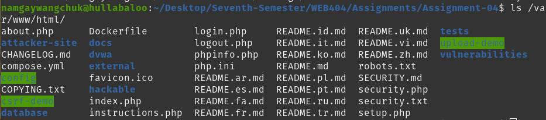

*Terminal output confirming all expected DVWA files and folders (`login.php`, `setup.php`, `vulnerabilities/`, `config/`, `database/`, etc.) are still present, alongside folders from other assignments (`csrf-demo`, `upload-demo`, `attacker-site`).*

### 4.2 Logging in and setting the security level to Low

Logging in with the default credentials (`admin` / `password`) revealed the security level had reset to **"impossible"** since the last assignment.

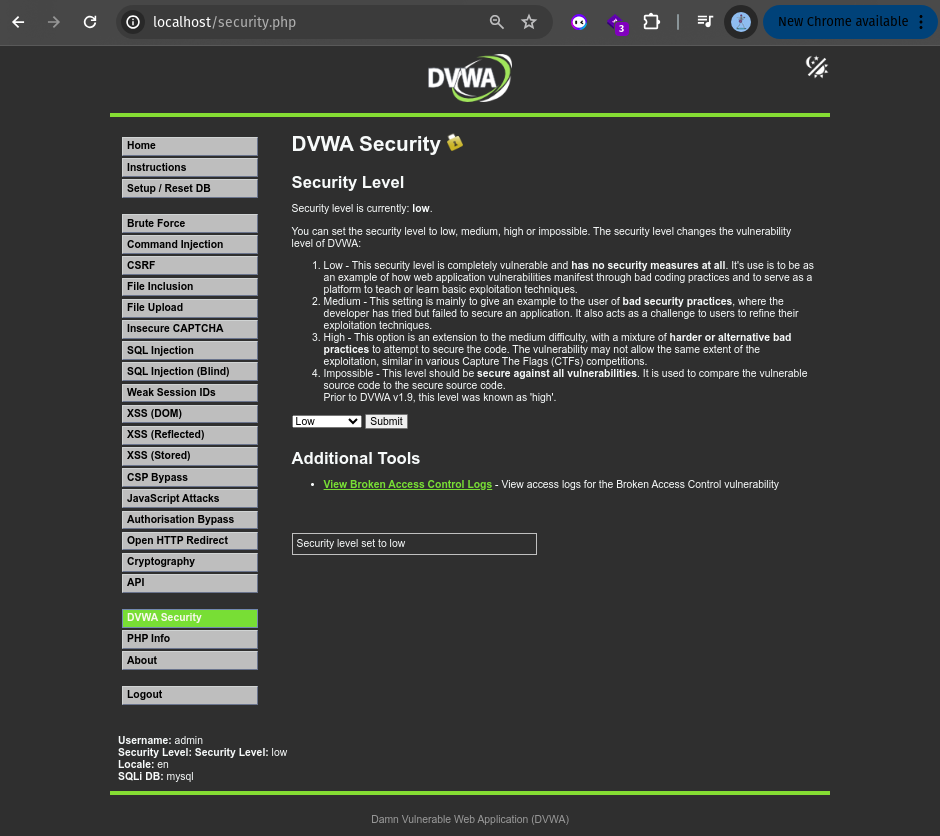

*Confirmation that the security level was successfully changed to "Low," making the application's intentional vulnerabilities fully exploitable for this assignment.*

---

## 5. Part B; Attack Type 1: Logic-Based / Authentication Bypass Injection

### 5.1 The target : SQL Injection lab

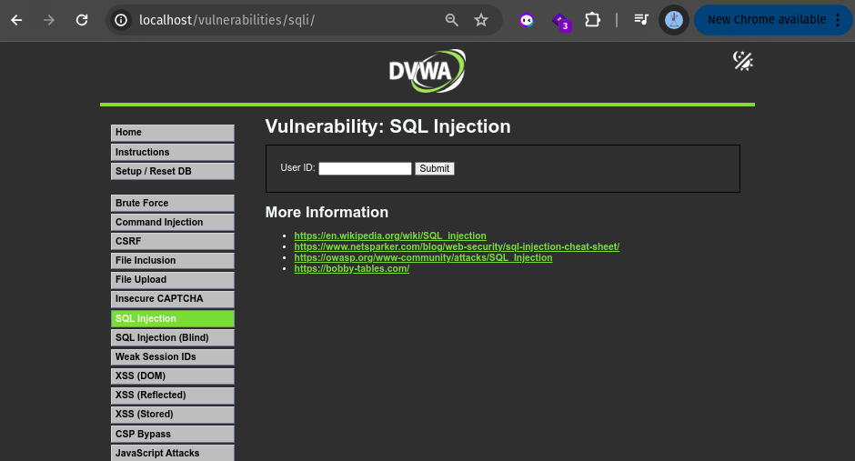

*The SQL Injection lab's forming a simple "User ID" text box designed to look up and display one user's first and last name.*

### 5.2 Confirming normal, legitimate behavior

Before attacking the form, a valid ID was submitted to confirm the feature works as intended:

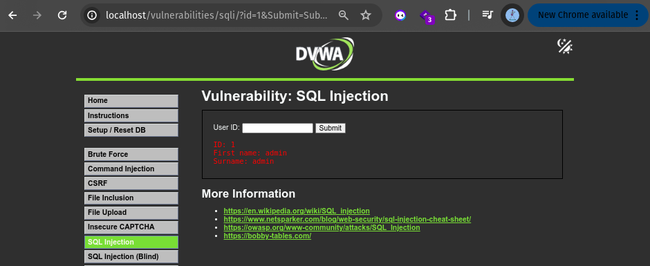

*Submitting `1` correctly returns a single result: First name "admin", Surname "admin". The URL bar also reveals the form submits via GET, with the value passed directly as `?id=1`; making injection payloads straightforward to test.*

### 5.3 Performing the attack

**Payload used:**
```
' OR '1'='1
```

**Why this works:** the vulnerable query becomes:
```sql
SELECT first_name, last_name FROM users WHERE user_id = '' OR '1'='1';
```
Since the condition `'1'='1'` is always true, the `OR` clause causes the query's `WHERE` condition to match **every row** in the table, regardless of the actual `user_id` value.

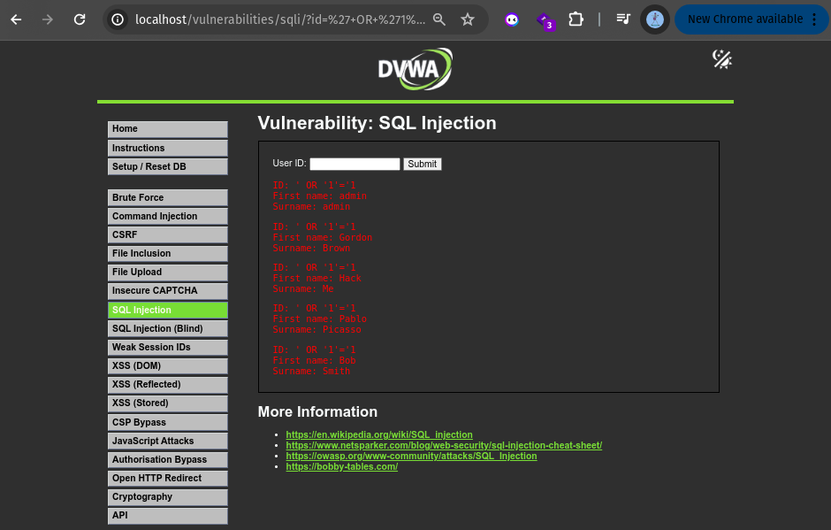

*Result: instead of one user, the query returns all five users in the database; admin, Gordon Brown, Hack Me, Pablo Picasso, and Bob Smith, each proving the injected condition successfully bypassed the intended single-row lookup.*

**Severity:** this same technique, applied to a login form's username/password fields rather than a lookup form, is commonly used in real attacks to bypass authentication entirely without knowing any valid password.

---

## 6. Part C; Attack Type 2: UNION-Based Injection

### 6.1 Determining the number of columns

`UNION` requires both halves of the combined query to return the same number of columns, so this was determined first using the `ORDER BY` technique; incrementally testing column positions until an error is triggered.

**Payload 1:** `' ORDER BY 1-- -`


*No error means column 1 exists.*

**Payload 2:** `' ORDER BY 2-- -`

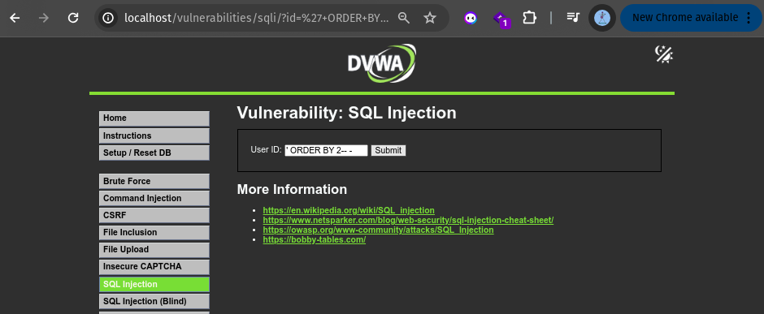

*Still no error means column 2 also exists.*

**Payload 3:** `' ORDER BY 3-- -`

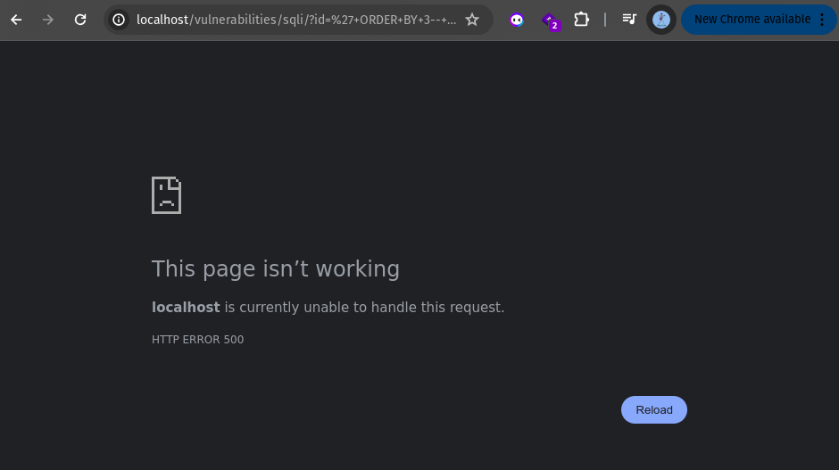

*This triggers an HTTP 500 error, confirming there is no third column. **Conclusion: the underlying query selects exactly 2 columns** a fact later confirmed directly in the application's source code (Section 8).*

### 6.2 Extracting credentials with UNION SELECT

With the column count confirmed, a `UNION SELECT` was crafted to pull data from DVWA's internal `users` table; a completely different, more sensitive table than the one this form was designed to query, containing actual login usernames and password hashes.

**Payload:**
```
' UNION SELECT user, password FROM users-- -
```

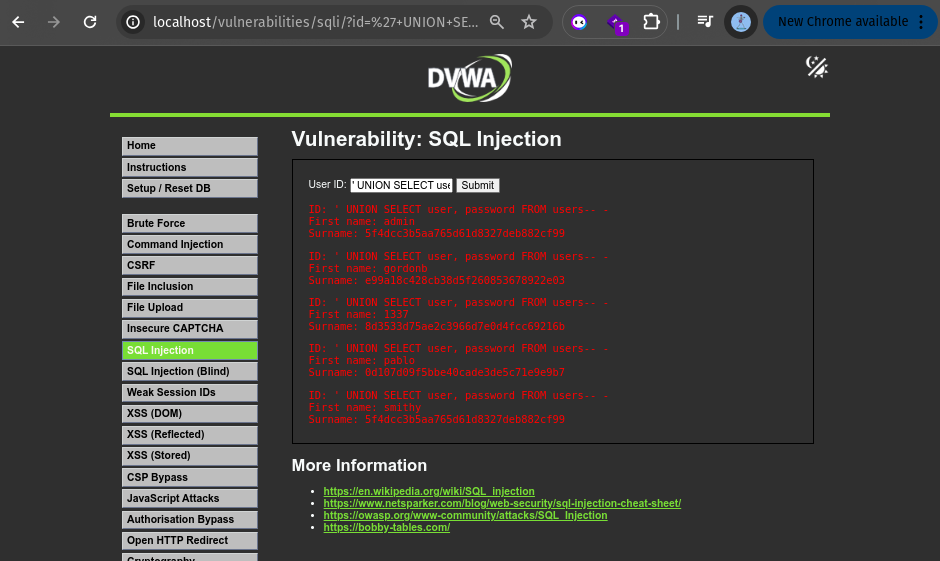

*Result: real login credentials extracted directly through the public-facing lookup form:*

| Username | Password Hash (MD5) |
|---|---|
| admin | 5f4dcc3b5aa765d61d8327deb882cf99 |
| gordonb | e99a18c428cb38d5f260853678922e03 |
| 1337 | 8d3533d75ae2c3966d7e0d4fcc69216b |
| pablo | 0d107d09f5bbe40cade3de5c71e9e9b7 |
| smithy | 5f4dcc3b5aa765d61d8327deb882cf99 |

**Notable observation:** the `admin` and `smithy` accounts share the identical hash `5f4dcc3b5aa765d61d8327deb882cf99`, indicating both accounts use the same password. This particular hash is a widely documented example in security education; it is the MD5 digest of the plaintext string `"password"`, and appears in virtually every publicly available rainbow table, meaning it could be reversed almost instantly by an attacker without needing to brute-force it. This also illustrates why MD5 is considered cryptographically unsuitable for password storage in modern applications; it is fast to compute, which is exactly the wrong property for a password hash, and has no built-in protection (such as salting) in this implementation.

**Severity:** this is the most damaging of the three attacks demonstrated, as it directly exposes authentication credentials for every user account in the system.

---

## 7. Part D; Attack Type 3: Blind (Boolean-Based) SQL Injection

### 7.1 The target : SQL Injection (Blind) lab

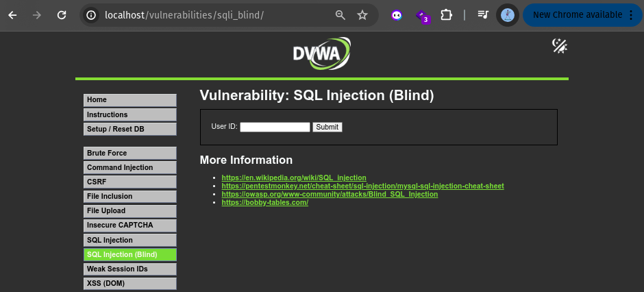

*A form visually identical to the regular SQL Injection lab, but its underlying query behaves very differently; no data or error messages are ever shown to the user directly.*

### 7.2 Establishing the TRUE / FALSE baseline

**Input `1` (a valid, existing user ID):**

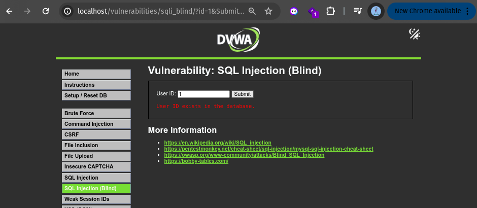

*Response: "User ID exists in the database."*

**Input `50` (a non-existent user ID):**


*Response: "User ID is MISSING from the database."*

This confirms the application only ever reveals one of two fixed messages; no actual data, no SQL error text; which is precisely what makes this injection "blind." Every piece of information must be inferred purely from which of these two messages appears.

### 7.3 Proving control over the TRUE / FALSE outcome

**Payload:** `1' AND '1'='1`

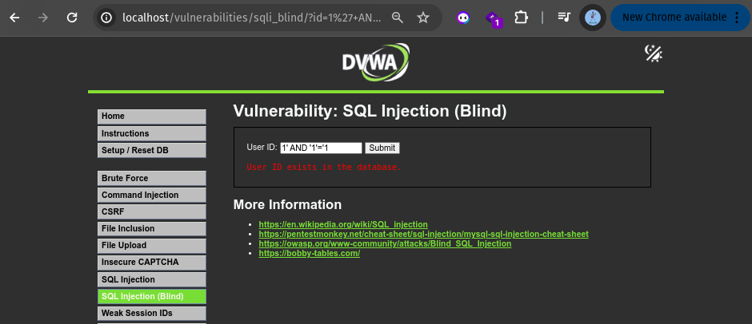

*Response: "User ID exists in the database." Since `'1'='1'` is always true, and ID 1 genuinely exists, this correctly evaluates as TRUE.*

**Payload:** `1' AND '1'='2`


*Response: "User ID is MISSING from the database"; despite ID 1 being a real, existing user. Because `'1'='2'` is always false, the entire `AND` condition evaluates to false, flipping the result regardless of whether the underlying ID actually exists. This pairing is the core proof of blind SQL injection: the same real user ID produces opposite results purely based on injected logic.*

### 7.4 Extracting real data using boolean inference

With control over the TRUE/FALSE outcome established, the same technique was used to extract genuine information about the database; specifically, the name of the current database, one fact at a time.

**Step 1 : Determine the database name's length**

Payload: `1' AND LENGTH(database())=4-- -`


*Result: TRUE ("User ID exists in the database"); confirming the current database name is exactly 4 characters long.*

Payloads `LENGTH(database())=5` and `LENGTH(database())=6` were also tested:


*Both return FALSE, ruling out those lengths and reinforcing that 4 is the correct length.*

**Step 2 : Determine the first character**

Payload: `1' AND SUBSTRING(database(),1,1)='d'-- -`


*Result: TRUE the first character of the database name is confirmed to be `'d'`.*

Payload: `1' AND SUBSTRING(database(),1,1)='a'-- -`

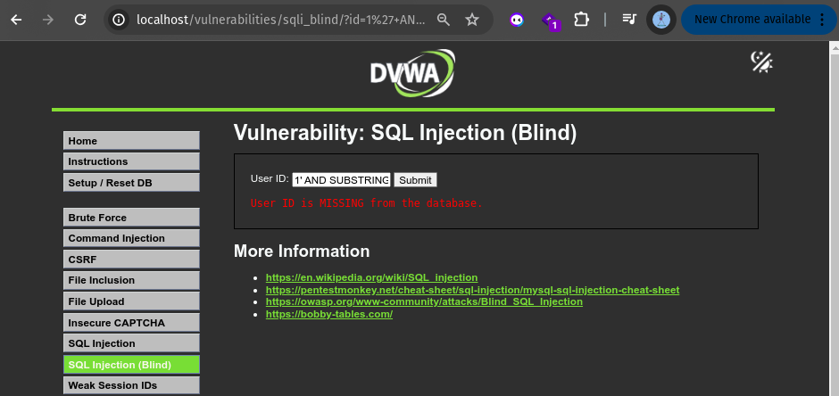

*Result: FALSE, as expected; confirming the technique correctly distinguishes right from wrong guesses.*

**Conclusion:** through pure TRUE/FALSE inference alone; never seeing a single piece of raw data directly; it was established that the current database name is 4 characters long and begins with the letter "d" (consistent with the database being named `dvwa`). Repeating this `SUBSTRING()` approach for each remaining character position would eventually reveal the entire database name, and the same method can be extended to extract table names, column names, and even data values such as password hashes, entirely through this blind, one-character-at-a-time process.

---

## 8. Part E : Source Code Analysis (Why the Vulnerability Exists)

### 8.1 SQL Injection la : vulnerable source code (Low security)

```php
if( isset( $_REQUEST[ 'Submit' ] ) ) {
    $id = $_REQUEST[ 'id' ];

    switch ($_DVWA['SQLI_DB']) {
        case MYSQL:
            $query  = "SELECT first_name, last_name FROM users WHERE user_id = '$id';";
            $result = mysqli_query($GLOBALS["___mysqli_ston"], $query) or die(...);

            while( $row = mysqli_fetch_assoc( $result ) ) {
                $first = $row["first_name"];
                $last  = $row["last_name"];
                echo "<pre>ID: {$id}<br />First name: {$first}<br />Surname: {$last}</pre>";
            }
            break;
    }
}
```

*The full source code for the vulnerable "Low" security level, confirming both the query structure and the exact column names (`first_name`, `last_name`); matching the 2-column count deduced earlier through the `ORDER BY` technique.*

**The vulnerable line:**
```php
$query = "SELECT first_name, last_name FROM users WHERE user_id = '$id';";
```
The value of `$id`, taken directly from `$_REQUEST['id']` with no validation or sanitization whatsoever, is inserted straight into the query string via PHP string interpolation. This is the single root cause enabling every attack demonstrated in Sections 5 and 6.

### 8.2 SQL Injection (Blind) lab : vulnerable source code (Low security)

```php
if( isset( $_GET[ 'Submit' ] ) ) {
    $id = $_GET[ 'id' ];
    $exists = false;

    switch ($_DVWA['SQLI_DB']) {
        case MYSQL:
            $query  = "SELECT first_name, last_name FROM users WHERE user_id = '$id';";
            try {
                $result = mysqli_query($GLOBALS["___mysqli_ston"], $query);
            } catch (Exception $e) {
                print "There was an error.";
                exit;
            }
            $exists = ($result !== false) ? (mysqli_num_rows($result) > 0) : false;
            break;
    }

    if ($exists) {
        echo '<pre>User ID exists in the database.</pre>';
    } else {
        header( $_SERVER[ 'SERVER_PROTOCOL' ] . ' 404 Not Found' );
        echo '<pre>User ID is MISSING from the database.</pre>';
    }
}
```

*The blind version's source code, showing the identical vulnerable query construction as the regular version, but with a critical difference in how results are handled.*

**Key difference explaining the "blind" behavior:** rather than looping through and printing each row's actual data (`$row["first_name"]`, etc.), this version only checks `mysqli_num_rows($result) > 0` a simple count, and displays one of exactly two fixed messages based on that count. This is precisely why no data or error text is ever visible, and why extracting information requires the true/false inference technique demonstrated in Section 7.

---

## 9. Part F : Demonstrating the Fix

### 9.1 Switching to the "Impossible" security level

The DVWA security level was changed to **Impossible**; the application's fully-patched configuration, intended for comparing vulnerable and secure source code side by side.

### 9.2 Re-running the original attack

The exact same payload that successfully dumped all five users in Section 5 was submitted again:

**Payload:** `' OR '1'='1`

*Result: no data returned whatsoever no names, no error, nothing. The identical payload that previously exposed every user's data now produces no output at all.*

### 9.3 Fixed source code : SQL Injection (Impossible)

```php
if( isset( $_GET[ 'Submit' ] ) ) {
    checkToken( $_REQUEST[ 'user_token' ], $_SESSION[ 'session_token' ], 'index.php' );

    $id = $_GET[ 'id' ];

    if(is_numeric( $id )) {
        $id = intval($id);
        switch ($_DVWA['SQLI_DB']) {
            case MYSQL:
                $data = $db->prepare( 'SELECT first_name, last_name FROM users WHERE user_id = (:id) LIMIT 1;' );
                $data->bindParam( ':id', $id, PDO::PARAM_INT );
                $data->execute();
                $row = $data->fetch();

                if( $data->rowCount() == 1 ) {
                    $first = $row[ 'first_name' ];
                    $last  = $row[ 'last_name' ];
                    echo "<pre>ID: {$id}<br />First name: {$first}<br />Surname: {$last}</pre>";
                }
                break;
        }
    }
}
generateSessionToken();
```

### 9.4 Why this fix works : two layers of defense

**Layer 1 : Input type validation**
```php
if(is_numeric( $id )) {
    $id = intval($id);
```
Since a `user_id` is meant to be a number, the code first verifies this explicitly. Any injection payload containing SQL syntax (such as `' OR '1'='1`) is not numeric, so it fails this check immediately; the database query is never even reached. `intval()` then forces the value into a genuine integer, discarding anything non-numeric as an extra safeguard.

**This directly explains the attack's failure in Section 9.2** : the payload was rejected by `is_numeric()` before the vulnerable-style query construction could even be attempted.

**Layer 2 : Prepared statements (the structural fix)**
```php
$data = $db->prepare( 'SELECT first_name, last_name FROM users WHERE user_id = (:id) LIMIT 1;' );
$data->bindParam( ':id', $id, PDO::PARAM_INT );
$data->execute();
```

This is the fundamental, industry-standard defense against SQL injection. Rather than building the query as a single string with user input glued directly into it, the process is split into two distinct steps:

1. `prepare()` sends the query's **structure** to the database first, with `:id` as an empty placeholder; no actual value has been provided yet, so there is nothing for injected syntax to interfere with.
2. `bindParam()` then sends the actual value **separately**, explicitly tagged as `PDO::PARAM_INT` (an integer type).

Because the database has already compiled and locked in the query's logical structure before ever receiving the value, anything sent through the bound parameter is treated strictly as **data to compare against**; never as executable SQL syntax. Even if a malicious string somehow bypassed the `is_numeric()` check, it would simply be treated as an invalid integer value, not as SQL code capable of altering the query's meaning.

**Bonus observation:** the Impossible-level code also includes a `checkToken()` call; a CSRF protection check; demonstrating that DVWA's most secure tier layers multiple, independent defenses together (input validation, parameterized queries, and CSRF protection), reflecting the same defense-in-depth principle explored across this assignment series.

---

## 10. Before vs. After : Summary Table

| Aspect | Vulnerable ("Low") | Fixed ("Impossible") |
|---|---|---|
| Input type checked | No | Yes: `is_numeric()` + `intval()` |
| Query construction | Raw string concatenation (`"...'$id'..."`) | Prepared statement with bound parameter |
| `' OR '1'='1` result | Returns all 5 users | Returns nothing (input rejected as non-numeric) |
| UNION-based extraction | Successfully leaked usernames + password hashes | Not attempted; same structural defense (prepared statement + type check) blocks it identically |
| Blind boolean inference | Successfully inferred database name character-by-character | Not attempted; same defenses apply; the `is_numeric()` check alone would immediately reject any boolean-injection payload |
| Additional protection | None | CSRF token check also present |

---

## 11. Conclusion

This assignment demonstrated, through three distinct and increasingly sophisticated techniques, how a single line of vulnerable code; raw string concatenation of user input into a SQL query; can be exploited to bypass intended logic, extract sensitive credentials from unrelated tables, and infer arbitrary database information without ever seeing a single piece of raw data directly.

The logic-based attack (`' OR '1'='1`) proved that even the simplest injection payload can break a query's intended filtering entirely. The UNION-based attack went further, demonstrating that an attacker is not limited to the data a form was designed to show; by matching column counts, an entirely different and more sensitive table's contents can be pulled directly into the application's own output. The blind injection technique proved that even when an application appears to reveal nothing at all, careful true/false questioning can still systematically extract real information, one bit at a time.

Examining the source code confirmed that all three attacks shared the exact same root cause, and that the fix required two complementary layers: validating that input matches its expected type, and more fundamentally; using prepared statements to keep query structure and user data permanently separate at the database level, regardless of what the input contains.

---

## 12. Tools and Technologies Used

- **DVWA (Damn Vulnerable Web Application)** : intentionally vulnerable test target, reused from Assignment 1
- **PHP 8.1** with **MySQLi** (vulnerable version) and **PDO** (fixed version)
- **MariaDB** : database backend
- **Apache2** : web server (Ubuntu)
- **Google Chrome** :manual testing and payload submission via URL/form

